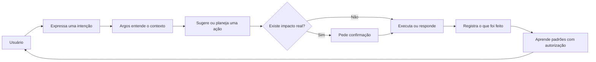
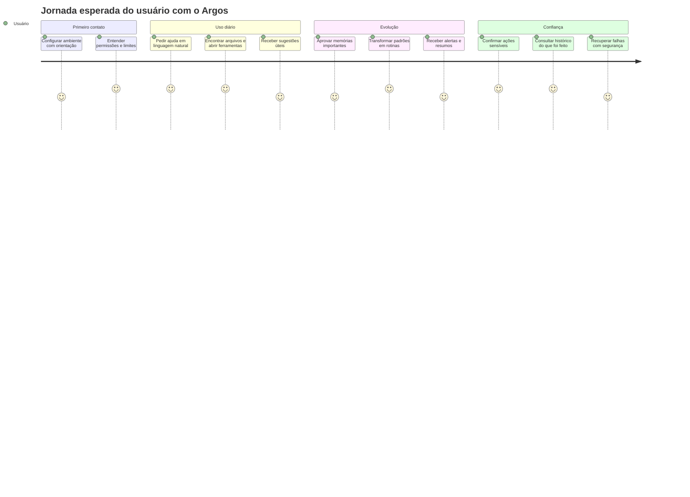
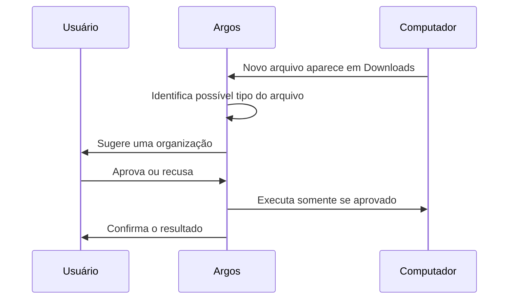
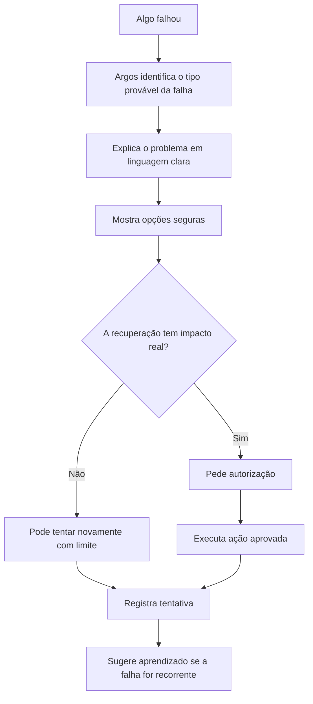
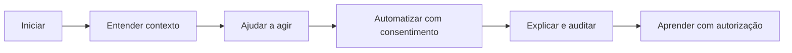
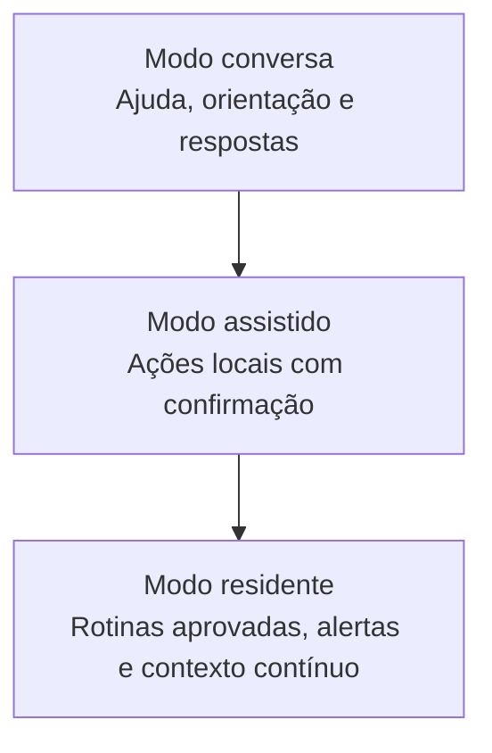

# Argos

> **Um assistente local para transformar o computador em um ambiente mais contextual, organizado, automatizável e seguro.**

Argos nasce com uma ideia simples: o usuário deveria conseguir conversar com o próprio computador, pedir ajuda em linguagem natural, organizar o ambiente, criar rotinas e executar ações locais sem perder controle sobre o que está acontecendo.

O objetivo final não é criar apenas uma CLI inteligente. O objetivo é construir uma camada de assistência local, residente e confiável para o uso diário do computador.

---

## Visão executiva

O Argos deve evoluir para ser um copiloto local do usuário: um assistente que entende contexto, lembra decisões importantes com autorização, sugere próximos passos, ajuda a operar arquivos e projetos, automatiza rotinas aprovadas e mantém tudo explicável.



A promessa do produto é:

> **Ajudar o usuário a operar o próprio computador com mais contexto, menos repetição e mais segurança.**

---

## O que o Argos quer resolver

Computadores acumulam arquivos, projetos, comandos, ferramentas, notas, downloads, tarefas e decisões. Grande parte do esforço diário não está em fazer uma única ação complexa, mas em lembrar onde as coisas estão, repetir pequenas rotinas, recuperar contexto e evitar erros operacionais.

O Argos busca reduzir esse atrito.

| Dor do usuário | Experiência esperada com o Argos |
|---|---|
| “Não lembro onde está aquele arquivo.” | O Argos ajuda a encontrar e abrir o item correto. |
| “Faço sempre os mesmos passos.” | O Argos sugere transformar o padrão em rotina aprovada. |
| “Não sei o que estava fazendo neste projeto.” | O Argos recupera contexto, decisões e pendências relevantes. |
| “Tenho medo de um agente mexer sozinho no meu PC.” | O Argos pede confirmação para ações sensíveis e registra tudo. |
| “Quando algo falha, perco tempo entendendo o erro.” | O Argos explica a falha e sugere recuperação segura. |

---

## Jornada de uso esperada

O Argos deve ser pensado pela jornada do usuário, não por uma lista de comandos.



### 1. Primeiro contato

No primeiro uso, o Argos deve ajudar o usuário a configurar uma experiência inicial segura e funcional.

A expectativa é que o usuário não precise entender toda a arquitetura interna para começar. O Argos deve explicar de forma clara:

- o que consegue fazer;
- o que precisa de autorização;
- quais limites de segurança existem;
- como o usuário pode ajustar o comportamento depois.

### 2. Uso diário

No uso diário, o Argos deve funcionar como uma camada de apoio rápido.

Exemplos de intenções:

```text
Abra meu projeto principal.
Encontre aquele PDF da faculdade.
Crie uma nota com essas ideias.
Mostre o que ficou pendente.
Resuma o que aconteceu na última execução.
```

O usuário não deve precisar decorar muitos comandos. A interação deve começar pela intenção.

### 3. Organização do ambiente

O Argos deve ajudar o usuário a organizar arquivos, downloads, documentos, projetos e notas.

A expectativa não é que ele mova tudo sozinho. A expectativa é que ele observe padrões, sugira caminhos e peça autorização antes de alterar algo.



### 4. Trabalho com projetos

Para projetos de desenvolvimento, estudo ou organização pessoal, o Argos deve recuperar contexto e ajudar o usuário a continuar de onde parou.

Perguntas esperadas:

```text
O que eu estava fazendo neste projeto?
Quais decisões importantes já tomamos?
Como rodo esse ambiente?
O que falhou na última vez?
Qual arquivo parece estar relacionado com esse problema?
```

O Argos deve evitar misturar informações de projetos diferentes. Contexto precisa ter escopo.

### 5. Criação de rotinas

O Argos deve permitir que o usuário descreva comportamentos desejados em linguagem natural.

Exemplos:

```text
Todo dia de manhã, mostre um resumo das minhas pendências.
Quando eu baixar um PDF, me pergunte se quero organizar.
Quando um job falhar, me avise e sugira recuperação.
Quando eu abrir este projeto, verifique se há tarefas pendentes.
```

Essas rotinas devem nascer como propostas revisáveis. O usuário deve conseguir entender o que será observado, o que será executado e quando será necessária confirmação.

### 6. Falhas e recuperação

Quando algo falhar, o Argos deve ajudar o usuário a entender o problema e escolher um caminho seguro.



O objetivo é que falhas não encerrem a experiência. Falhas devem iniciar diagnóstico, recuperação segura e aprendizado.

---

## Experiência desejada

A experiência final desejada pode ser resumida em cinco momentos.



O Argos deve dar ao usuário a sensação de que o computador está mais organizado, mais acessível e mais previsível, sem parecer que uma automação invisível tomou controle do ambiente.

---

## Princípios de produto

| Princípio | Significado |
|---|---|
| Local-first | O ambiente do usuário deve ser tratado como espaço privado. |
| Controle humano | Ações sensíveis exigem confirmação. |
| Clareza | O usuário precisa entender o que será feito. |
| Contexto | O Argos deve usar informações relevantes sem misturar escopos. |
| Aprendizado com autorização | Preferências e decisões podem ser lembradas, mas com limites claros. |
| Segurança operacional | O Argos deve evitar ações destrutivas, vazamento de segredos e automações imprevisíveis. |
| Explicabilidade | O usuário deve conseguir saber o que aconteceu e por quê. |

---

## Modos de experiência

O Argos deve crescer em três níveis de uso.



### Modo conversa

O usuário pede ajuda, tira dúvidas, resume informações e recebe orientação. Nesse modo, o Argos não deve realizar ações com efeito real sem confirmação.

### Modo assistido

O usuário pede uma ação local, como abrir arquivo, criar nota, buscar documento ou preparar uma rotina. O Argos interpreta, mostra o plano quando necessário e pede aprovação para ações sensíveis.

### Modo residente

O Argos acompanha eventos locais, executa rotinas aprovadas, envia notificações e ajuda o usuário a manter o ambiente organizado. Mesmo nesse modo, ações sensíveis continuam passando por política e autorização.

---

## O que o Argos não deve ser

O Argos não deve ser um executor cego de comandos nem um agente que decide sozinho alterar o computador do usuário.

Ele não deve:

- salvar senhas, tokens ou credenciais como memória;
- executar comandos destrutivos automaticamente;
- mover ou apagar arquivos sem confirmação;
- instalar ferramentas sem aprovação;
- habilitar automações sem revisão;
- esconder do usuário o que fez;
- depender de um único modelo ou provedor como base permanente;
- misturar documentação executiva com detalhes técnicos de implementação.

---

## Objetivo final

O objetivo final do Argos é ser uma camada local de assistência contínua para o computador pessoal.

Em um cenário ideal:

```text
O usuário inicia o computador.
Argos apresenta um resumo curto e útil.
Argos lembra contexto dos projetos ativos.
Argos sugere ações relevantes.
Argos observa eventos aprovados.
Argos pede confirmação para ações sensíveis.
Argos registra o que executou.
Argos aprende padrões com autorização.
```

A direção pode ser resumida assim:

> **Argos deve entender o ambiente, ajudar o usuário a agir, automatizar com consentimento e manter tudo explicável.**

---

## Documentação técnica

Este README descreve a visão executiva, a jornada de uso e as expectativas do produto.

Detalhes de arquitetura, módulos internos, fluxos técnicos, decisões de implementação e critérios de aceite devem ficar em:

```text
docs/ARCHITECTURE.md
```

Essa separação é intencional: o README explica a experiência desejada; a documentação técnica explica como essa experiência será construída.

---

## Status

O Argos está em construção ativa.

A versão atual deve ser entendida como uma base inicial para validar a experiência de um assistente local controlado pelo usuário. O objetivo é evoluir gradualmente até uma experiência residente, segura, contextual e útil para o uso diário do computador.