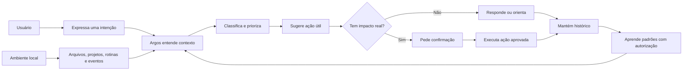
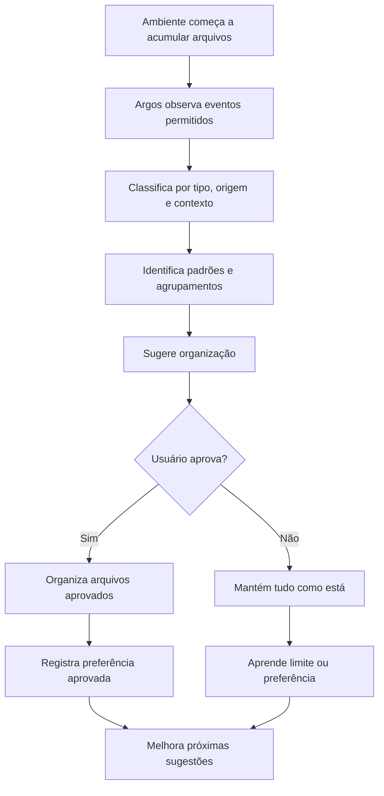
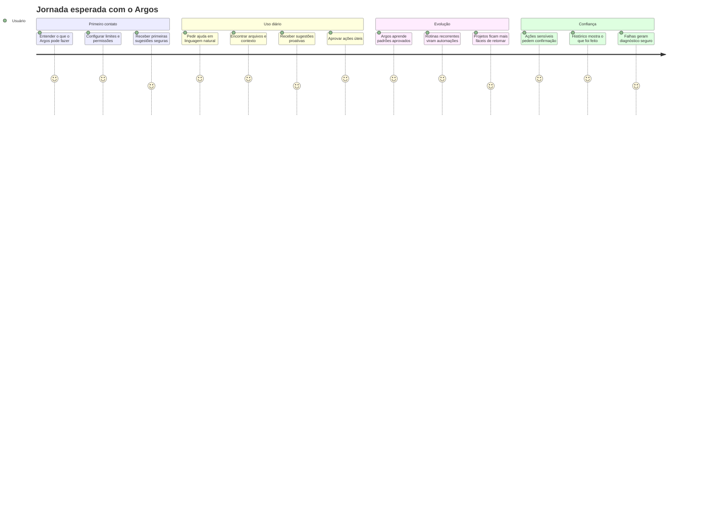
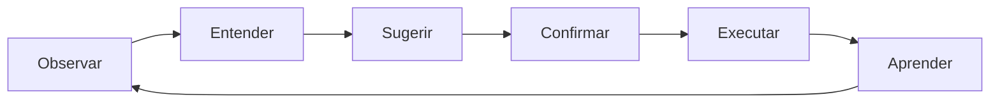
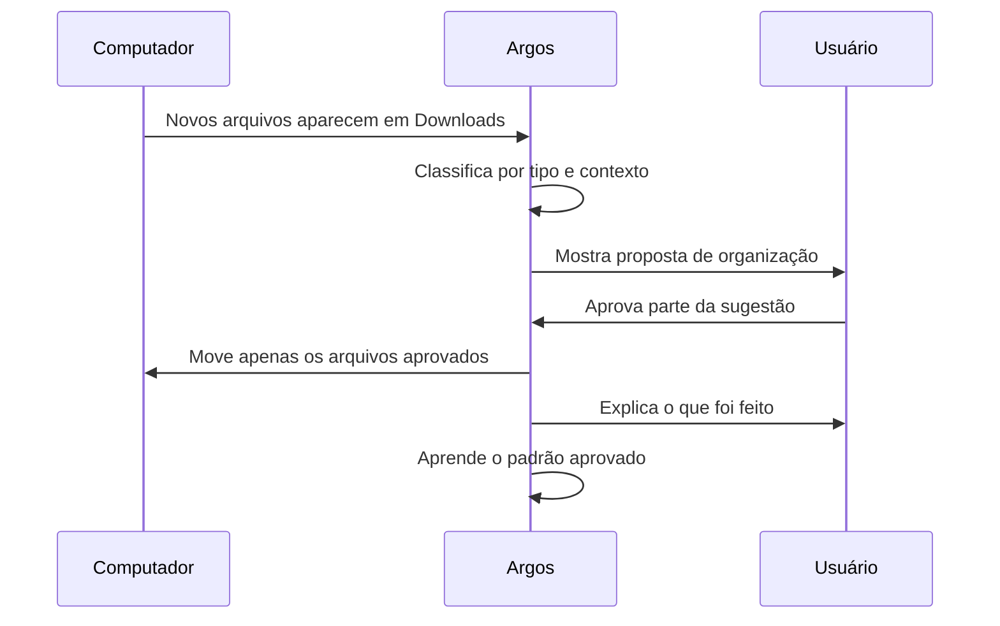
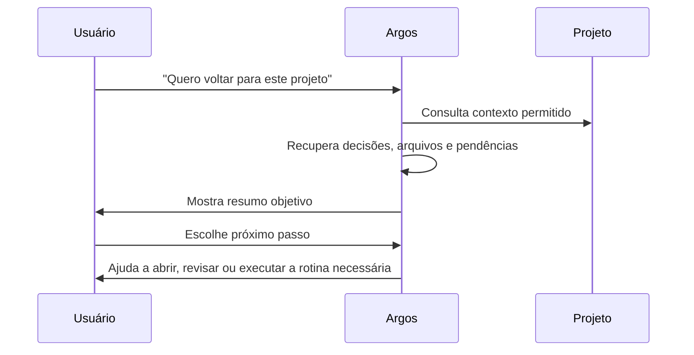
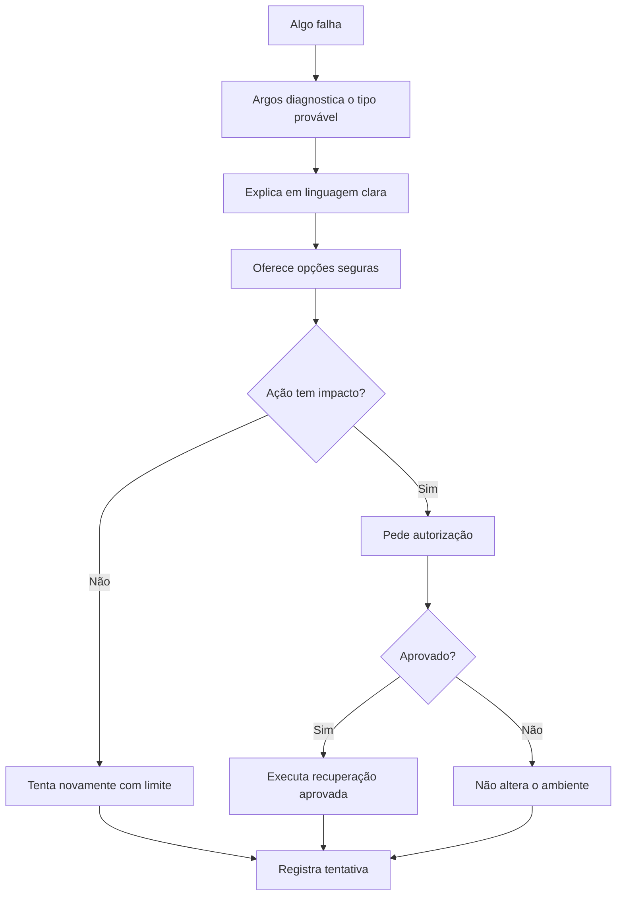
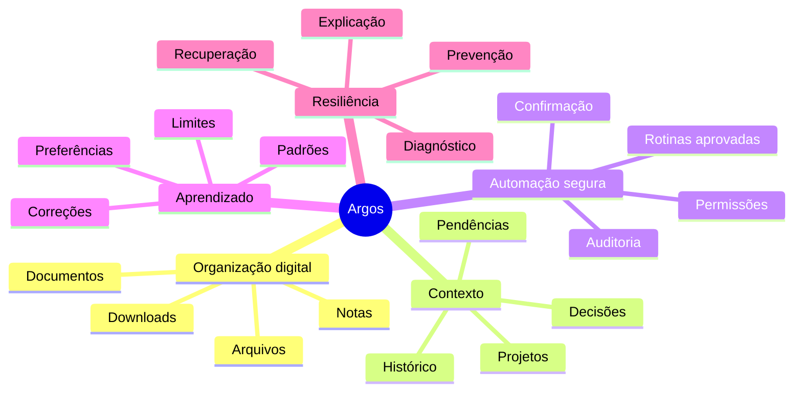
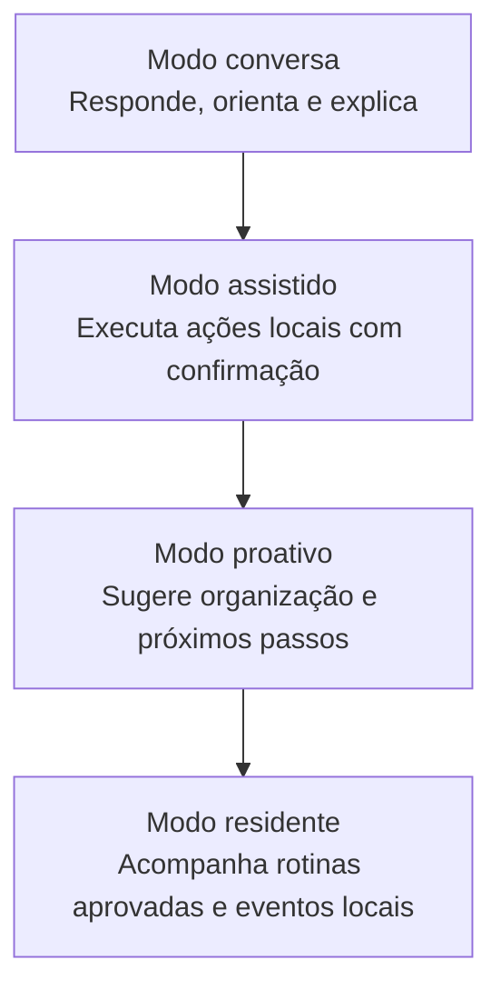

# Argos

<p align="center">
  <strong>Um assistente local para organizar, contextualizar e automatizar o computador pessoal com segurança.</strong>
</p>

<p align="center">
  
  
  
  
  
</p>

---

## Visão executiva

O **Argos** é um assistente pessoal local para Windows pensado para transformar o computador em um ambiente mais organizado, contextual, automatizável e previsível.

A proposta não é criar apenas um chat, uma CLI ou um executor de comandos. A proposta é criar uma camada de assistência contínua que ajude o usuário a lidar com arquivos, projetos, rotinas, contexto e pequenas decisões operacionais do dia a dia.

> [!IMPORTANT]
> O objetivo final do Argos é ajudar o usuário a manter o próprio ambiente digital em ordem, reduzir repetição e agir com mais segurança, sem perder controle sobre o que será executado.

---

## Promessa do produto

O Argos deve evoluir para um assistente que:

- entende intenções em linguagem natural;
- observa sinais do ambiente local com permissão;
- identifica oportunidades de organização;
- classifica arquivos, notas, projetos e eventos;
- sugere próximos passos úteis;
- aprende preferências aprovadas pelo usuário;
- transforma padrões recorrentes em automações seguras;
- pede confirmação antes de ações sensíveis;
- registra o que foi feito para manter transparência.



---

## O problema que o Argos quer resolver

Grande parte do atrito no uso diário do computador não está em uma única tarefa complexa. Está em pequenas fricções repetidas:

| Atrito do usuário | Experiência esperada com o Argos |
|---|---|
| Downloads acumulam e viram bagunça. | O Argos identifica arquivos novos, classifica e sugere organização. |
| Documentos ficam espalhados entre pastas. | O Argos propõe agrupamentos, nomes e destinos coerentes. |
| Projetos perdem contexto com o tempo. | O Argos recupera decisões, pendências e arquivos relevantes. |
| Rotinas são repetidas manualmente. | O Argos sugere transformar padrões em automações revisáveis. |
| Falhas interrompem o fluxo de trabalho. | O Argos explica o problema e propõe recuperação segura. |
| Agentes podem parecer perigosos. | O Argos mantém controle humano, confirmação e auditoria. |

---

## Organização proativa do ambiente digital

Um dos principais potenciais do Argos é atuar como um **organizador proativo do ambiente local**.

Isso não significa mover arquivos sozinho ou assumir controle do computador. Significa perceber oportunidades de organização, explicar a sugestão e pedir confirmação quando houver impacto real.



### Exemplo de evolução de uso

| Momento | Comportamento esperado |
|---|---|
| Primeiro contato | “Encontrei vários arquivos em Downloads. Posso analisar e sugerir uma organização?” |
| Após algumas aprovações | “Percebi que você costuma separar boletos, faculdade e projetos. Deseja manter esse padrão?” |
| Uso recorrente | “Tenho uma proposta para organizar 12 arquivos novos. Nada será movido sem sua confirmação.” |
| Automação aprovada | “Arquivos acadêmicos podem ser sugeridos automaticamente para a pasta Faculdade. Deseja ativar essa rotina?” |

> [!NOTE]
> O valor não está em mover um PDF. O valor está em criar um ciclo contínuo de classificação, sugestão, aprovação, organização e aprendizado.

---

## Jornada de uso esperada

O Argos deve ser pensado como uma jornada, não como uma lista de comandos.



---

## Experiência desejada

A experiência final desejada pode ser resumida em seis momentos:



### 1. Observar

O Argos acompanha sinais permitidos do ambiente local, como arquivos novos, projetos abertos, jobs, histórico recente e rotinas recorrentes.

### 2. Entender

O Argos interpreta contexto: tipo de arquivo, relação com projeto, intenção do usuário, histórico de decisões e limites de segurança.

### 3. Sugerir

O Argos propõe ações compreensíveis, como organizar arquivos, recuperar contexto de um projeto, criar nota, abrir ambiente de trabalho ou revisar uma falha.

### 4. Confirmar

Antes de qualquer impacto real, o Argos deve pedir autorização. O usuário continua sendo o ponto de decisão.

### 5. Executar

O Argos executa apenas o que foi permitido, respeitando escopo, política e permissões.

### 6. Aprender

Quando o usuário aprova, rejeita ou corrige uma sugestão, o Argos pode transformar isso em preferência, padrão ou rotina futura, sempre com limites claros.

---

## Exemplos de jornadas de valor

### Organização pessoal



### Retomada de projeto



### Recuperação segura de falhas



---

## Princípios de produto

| Princípio | Expectativa |
|---|---|
| Local-first | O computador do usuário é o centro da experiência. |
| Proatividade controlada | O Argos pode sugerir antes de ser chamado, mas não deve agir sem limites. |
| Controle humano | Ações com impacto real exigem confirmação. |
| Contexto com escopo | Informações de projetos, arquivos e memórias não devem ser misturadas indevidamente. |
| Organização contínua | O Argos deve reduzir bagunça digital, repetição e perda de contexto. |
| Aprendizado com autorização | Preferências e padrões só devem ser persistidos com segurança. |
| Explicabilidade | O usuário deve entender o que foi sugerido, feito ou recusado. |
| Segurança operacional | Segredos, comandos perigosos e ações destrutivas devem ser bloqueados ou exigir aprovação explícita. |
| Independência de modelo | O produto não deve depender de um único modelo ou provedor. |

---

## O que o Argos deve ser

O Argos deve ser uma camada local de assistência que ajuda o usuário a:

- organizar arquivos e documentos;
- retomar projetos com contexto;
- criar notas, rotinas e procedimentos;
- reduzir tarefas repetitivas;
- transformar padrões em automações aprovadas;
- entender falhas e recuperar com segurança;
- manter visibilidade sobre o que aconteceu.



---

## O que o Argos não deve ser

O Argos não deve ser um agente invisível que mexe no computador sem controle.

Ele não deve:

- apagar arquivos automaticamente;
- mover documentos sensíveis sem confirmação;
- executar comandos destrutivos;
- salvar senhas, tokens ou credenciais como memória;
- instalar ferramentas sem aprovação;
- habilitar automações sem revisão;
- esconder o que fez;
- tomar decisões irreversíveis sozinho;
- depender de um único modelo como base permanente.

> [!CAUTION]
> A proatividade do Argos deve ser sempre limitada por política, aprovação e auditoria.

---

## Modos de experiência

O Argos deve crescer em níveis de autonomia claros.



| Modo | O que acontece | Limite esperado |
|---|---|---|
| Conversa | O usuário pede ajuda e recebe orientação. | Sem ação real sem confirmação. |
| Assistido | O usuário pede uma ação local. | O Argos executa somente o que for permitido. |
| Proativo | O Argos identifica oportunidades úteis. | Sugere antes de agir. |
| Residente | O Argos acompanha rotinas aprovadas. | Ações sensíveis continuam exigindo política e auditoria. |

---

## Objetivo final

O objetivo final do Argos é criar uma experiência em que o computador pareça menos fragmentado, menos repetitivo e mais fácil de operar.

Em um cenário ideal:

```text
O usuário inicia o computador.
Argos apresenta um resumo curto e útil.
Argos identifica arquivos, projetos e pendências relevantes.
Argos sugere organização quando percebe bagunça acumulada.
Argos relembra contexto aprovado de projetos em andamento.
Argos propõe rotinas quando identifica padrões repetidos.
Argos pede confirmação antes de qualquer ação sensível.
Argos registra o que foi feito.
Argos aprende com aprovações, recusas e correções.
```

A direção pode ser resumida assim:

> **Argos deve observar com permissão, entender contexto, sugerir com clareza, agir com consentimento e aprender com segurança.**

---

## Documentação técnica

Este README descreve a visão executiva, a jornada de uso, as expectativas de usabilidade e o objetivo final do produto.

Detalhes técnicos, arquitetura, módulos, fluxos internos, políticas, decisões de implementação e critérios de aceite devem ficar em:

```text
docs/ARCHITECTURE.md
docs/WORKFLOWS.md
```

Essa separação é intencional:

| Documento | Público | Linguagem |
|---|---|---|
| `README.md` | Usuários, avaliadores e visão de produto | Executiva, clara e orientada à experiência |
| `docs/ARCHITECTURE.md` | Desenvolvimento e evolução técnica | Técnica, modular e orientada à implementação |
| `docs/WORKFLOWS.md` | Usuários avançados e desenvolvimento | Operacional, declarativa e orientada à segurança do ADW |

---

## Estado do projeto

O Argos está em construção ativa.

A versão atual deve ser entendida como uma base inicial para validar a experiência de um assistente local controlado pelo usuário. A direção do produto é evoluir gradualmente para uma assistência residente, proativa, segura, contextual e útil para o uso diário do computador.
