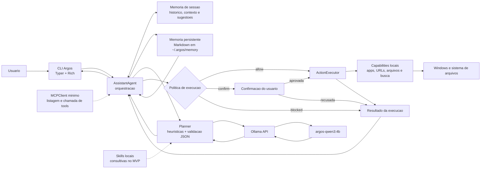
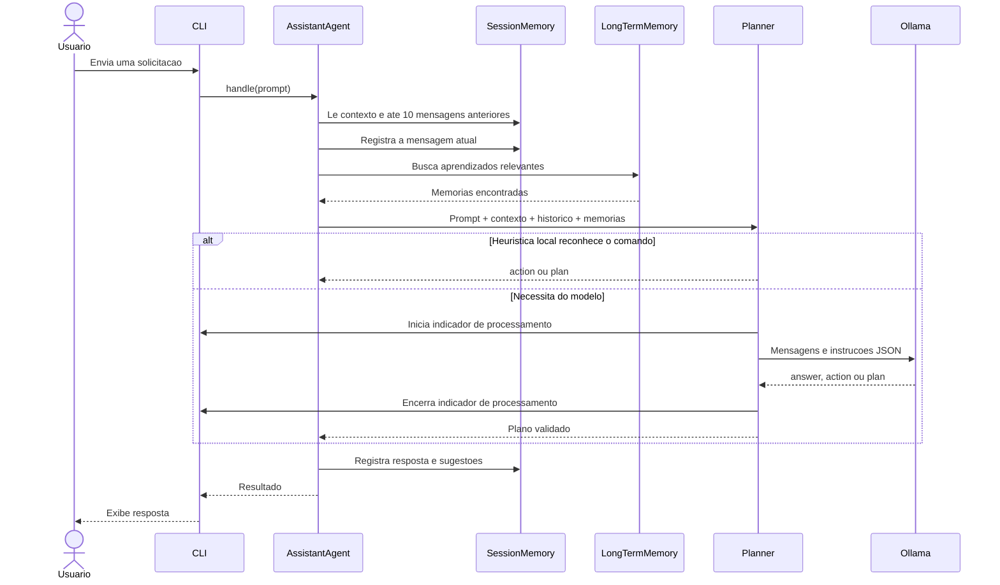
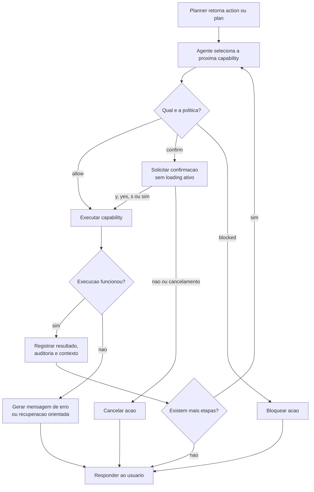
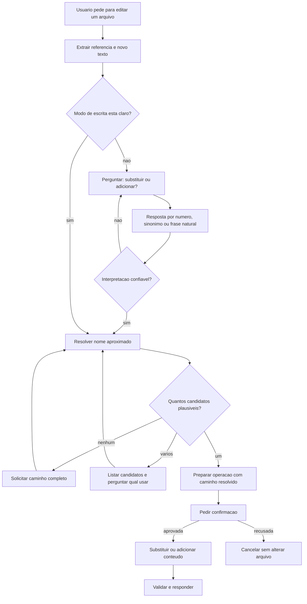
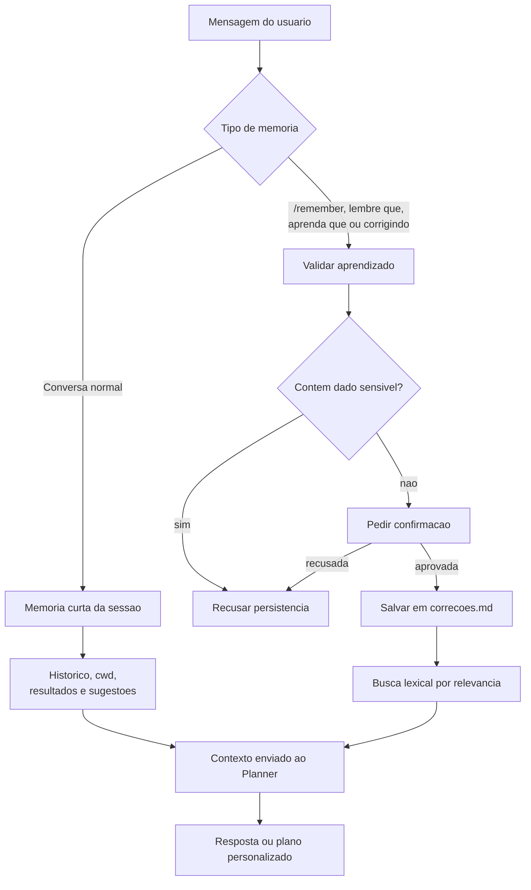
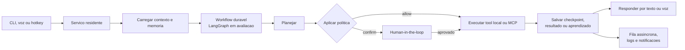
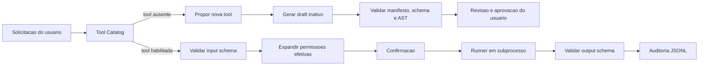

# Argos

Argos e um assistente pessoal local para Windows, construido em Python e integrado ao Ollama.

O objetivo do projeto e evoluir de uma CLI inteligente para um assistente assincrono residente no computador, capaz de ser acionado por voz, responder por voz, configurar ferramentas locais e executar tarefas na maquina pessoal com controle de seguranca.

## Contexto

Argos nasce como um assistente offline-first. A primeira versao roda no terminal, usa um modelo local leve via Ollama e ja possui uma base modular para planejar comandos, aplicar politica de permissao e executar acoes locais.

A direcao do produto e transformar esse nucleo em um assistente de computador:

- acionamento por CLI hoje e por voz/hotkey no roadmap
- resposta por texto hoje e por voz no roadmap
- uso local e offline sempre que o modelo e as ferramentas estiverem disponiveis na maquina
- preferencia por modelos menores e mais eficientes para resposta rapida no computador pessoal
- inteligencia para configurar tools, skills e MCPs
- capacidade de chamar programas, abrir arquivos, pesquisar arquivos e operar ferramentas locais
- memoria progressiva para aprender preferencias, correcoes e procedimentos recorrentes
- execucao controlada por politica de seguranca antes de qualquer efeito colateral relevante

## Estado atual

O MVP atual entrega:

- comando principal `argos`
- modo one-shot com `argos chat "..."`
- modo interativo no terminal
- integracao com Ollama usando modelo local
- abertura de URLs
- abertura de aplicativos conhecidos
- abertura de arquivos
- criacao segura de arquivos com confirmacao
- busca de arquivos com confirmacao
- abertura de resultado por indice no modo interativo
- memoria curta de sessao
- primeira versao de memoria persistente em Markdown
- recuperacao de memorias persistentes relevantes antes do planejamento
- clarificacoes contextuais respondidas por numero ou linguagem natural
- resolucao de arquivos por nome parcial, extensao omitida ou erro de digitacao
- edicao segura de arquivos existentes com modos substituir e adicionar
- catalogo local de capabilities
- planos multi-etapa simples para criar arquivo e abrir em seguida
- politicas `allow`, `confirm` e `blocked`
- loader de skills locais
- adaptador MCP minimo
- catalogo inicial de skills do projeto
- Tool SDK com manifesto, schemas, lifecycle e catalogo dinamico
- execucao de tools aprovadas por protocolo JSON em subprocesso
- geracao de drafts de tools sem instalacao ou execucao automatica
- tool bundled para criar projetos Spring Boot

## Arquitetura

O Argos separa interpretacao, memoria, seguranca e execucao. O modelo local pode responder ou propor acoes, mas nao acessa diretamente o sistema operacional. Toda acao passa pelo agente, pela politica e pelo executor.



As setas pontilhadas representam integracoes existentes em nivel inicial, mas que ainda nao participam automaticamente de todo planejamento.

### Fluxo de conversa e planejamento



### Fluxo de execucao segura



### Fluxo de edicao de arquivos



### Fluxo de memoria



## Estrategia de modelo

O padrao do Argos deve priorizar eficiencia, baixa latencia e uso local confortavel. Por isso, o modelo operacional padrao e um modelo customizado no Ollama, atualmente `argos-qwen3:4b`, criado em cima de `qwen3:4b`.

Diretrizes:

- usar modelo pequeno para comandos, planejamento simples, CLI e automacao local
- manter persona e regras estaveis no `Modelfile`
- reservar modelos maiores para tarefas mais complexas, benchmark ou fallback configuravel
- manter o modelo configuravel para permitir troca conforme hardware e qualidade desejada
- medir qualidade por planejamento correto, JSON valido, latencia e consumo de recursos

Modelo recomendado para o MVP:

- padrao: `argos-qwen3:4b`
- base do modelo customizado: `qwen3:4b`
- alternativa mais forte: `qwen3:8b`

Opcoes de runtime usadas pelo Argos:

- `keep_alive`: `10m`, para manter o modelo carregado depois da primeira chamada
- `format`: `json`, para reduzir respostas fora do schema esperado
- `think`: `false`, para evitar custo extra de raciocinio em comandos curtos
- `num_predict`: `512`, para limitar respostas longas sem truncar JSON estruturado
- `num_ctx`: `4096`, para manter contexto suficiente sem custo excessivo

Camadas de customizacao:

- `Modelfile`: persona, idioma, formato JSON, parametros e regras estaveis
- memoria Markdown: preferencias, correcoes e aprendizados que mudam com o tempo
- LoRA/QLoRA futuro: padroes estaveis de tool-use, planejamento e estilo apos coleta de dataset

## Memoria progressiva

Argos deve evoluir para ter memoria de longo prazo semelhante a outros assistentes modernos. Quando o usuario corrigir uma resposta, ensinar uma preferencia ou definir um procedimento recorrente, o Argos deve propor salvar esse aprendizado.

Modelo de memoria planejado:

- memoria curta: contexto da sessao atual
- memoria longa: arquivos Markdown semanticos na pasta do usuario
- pasta sugerida: `%USERPROFILE%\.argos\memory`
- arquivos por tema, como `preferencias.md`, `projetos.md`, `ferramentas.md`, `comandos.md` e `correcoes.md`

Regras:

- nunca salvar segredos, tokens, senhas ou dados sensiveis
- pedir confirmacao antes de persistir memoria
- registrar aprendizados pequenos, objetivos e verificaveis
- recuperar memorias relevantes semanticamente antes de planejar respostas ou acoes
- manter o usuario capaz de ler, editar e apagar as memorias manualmente

Implementacao atual:

- comando interativo `/remember <aprendizado>`
- atalhos em linguagem natural: `lembre que ...`, `aprenda que ...` e `corrigindo: ...`
- confirmacao antes de salvar
- escrita em `%USERPROFILE%\.argos\memory\correcoes.md`
- bloqueio simples para conteudo sensivel como senha, token, secret ou chave privada
- comando `/memory` para listar memorias persistentes
- busca lexical simples para injetar memorias relevantes no contexto do planner

## Orquestracao de workflows

Argos deve manter o core atual simples enquanto o produto ainda esta focado em CLI, tools locais e memoria. A integracao com LangGraph deve entrar de forma incremental quando o projeto chegar em tarefas assincronas, modo residente, checkpoints, retomada de execucao e human-in-the-loop.

Decisao atual:

- nao reescrever o nucleo em LangChain agora
- manter planner, policy, executor e memoria com fronteiras proprias
- avaliar LangGraph como orquestrador para o modo residente
- usar LangChain somente quando uma integracao concreta justificar a dependencia

Fluxo futuro esperado:



## Roadmap

### Fase 1: CLI operacional

- melhorar comandos interativos como `/help`, `/skills`, `/tools`, `/model` e `/history`
- exibir resultados de busca com indices mais claros
- adicionar simulacao de comandos antes da execucao
- melhorar sugestoes contextuais
- integrar skills no prompt do planner
- melhorar consulta da memoria persistente com ranking semantico

### Fase 2: Tools e automacao local

- expandir `open_application` com catalogo configuravel de programas
- adicionar execucao controlada de comandos shell
- criar configuracao local para tools, paths e aliases
- permitir que Argos configure ferramentas pessoais com validacao
- melhorar suporte a MCP servers locais
- criar escrita controlada de memoria em Markdown

### Fase 3: Voz e assistente residente

- avaliar introducao incremental de LangGraph para workflows duraveis
- adicionar entrada por voz com STT local
- adicionar resposta por voz com TTS local
- criar acionamento por hotkey ou wake command
- rodar Argos em segundo plano
- manter estado entre sessoes
- permitir tarefas assincronas com fila, logs e notificacoes
- usar memoria persistente para personalizar respostas e acoes

### Fase 4: Inteligencia, avaliacao e tuning

- gerar datasets de comandos, planos e respostas
- criar curadoria de dataset
- comparar modelos locais por benchmark
- medir latencia e uso de recursos
- preparar LoRA/QLoRA para especializacao futura
- avaliar recuperacao semantica da memoria persistente

## Requisitos

- Python 3.12
- Ollama rodando localmente
- modelo base `qwen3:4b`
- modelo customizado `argos-qwen3:4b`

## Setup

```bash
python -m venv .venv
.venv\Scripts\activate
pip install -e .[dev]
ollama pull qwen3:4b
ollama create argos-qwen3:4b -f models/argos-qwen3-4b.Modelfile
```

## Uso

### Servico residente

O modo padrao usa o Argos Gateway local para manter a mesma sessao entre
terminais e reinicios do cliente:

```bash
argos start
argos status
argos
argos stop
```

Comandos enviados por `argos`, `argos interactive` e `argos chat` usam a
sessao `default`. Para separar contextos:

```bash
argos chat --session projeto-x "continue o projeto"
argos interactive --session projeto-x
```

O gateway aceita conexoes somente em `127.0.0.1` e exige um token local. O
estado padrao fica em `~/.argos`:

```text
config.yaml
argos.db
gateway.token
gateway.pid
logs/gateway.log
logs/events.jsonl
```

Para diagnostico, recuperacao ou uso sem o servico residente:

```bash
argos --direct
argos chat --direct "oi"
argos interactive --direct
```

O Argos nao troca silenciosamente para o modo direto quando o gateway esta
indisponivel, pois isso criaria uma sessao diferente.

### Jobs locais

A Fase 2 iniciou a fundacao de jobs persistentes em SQLite. Nesta etapa, o
Argos ja consegue registrar, consultar, cancelar e reenfileirar jobs; a
execucao automatica em background sera conectada nas proximas entregas.

```bash
argos jobs list
argos jobs show <job_id>
argos jobs retry <job_id>
argos jobs cancel <job_id>
```

Estados atuais: `queued`, `running`, `waiting_confirmation`, `succeeded`,
`failed`, `cancelled` e `cancelling`.

Configuracao minima opcional em `~/.argos/config.yaml`:

```yaml
schema_version: "1.0"
model: argos-qwen3:4b
gateway_host: 127.0.0.1
gateway_port: 17831
```

Se a porta estiver ocupada, altere `gateway_port` e reinicie o servico. Se o
Ollama estiver indisponivel, o gateway permanece diagnosticavel por
`argos status`, mas requisicoes ao modelo falharao ate o Ollama voltar.

Use `argos` para conversa continua no terminal:

```bash
argos
```

Exemplos no modo interativo:

```text
argos: oi
argos: open calculator
argos: vamos criar um markdown na pasta do meu usuario, esse arquivo markdown precisa ter hello world escrito
argos: find README.md
argos: /open 1
argos: exit
```

Use `argos chat "..."` para uma unica solicitacao:

```bash
argos chat "open ollama website"
argos chat "summarize what an MCP server is"
argos chat "find README.md"
```

O comando `assistant` ainda existe como alias de compatibilidade, mas o nome oficial do projeto e `argos`.

Durante chamadas ao modelo, a CLI mostra `Argos esta pensando...` enquanto aguarda a resposta. O indicador e encerrado antes de qualquer pedido de confirmacao, permitindo responder normalmente com `y`, `yes`, `s` ou `sim`.

Quando uma acao sensivel e planejada pelo gateway, o Argos mostra a capacidade,
os argumentos resumidos e as permissoes efetivas antes de executar. A
confirmacao pendente fica persistida no banco local, pode ser retomada apos
reiniciar o cliente ou o gateway e aceita apenas uma decisao. Interromper o
terminal nao registra a acao como recusada nem executa a operacao.

O contexto da sessao tambem guarda a tarefa ativa. Quando o usuario troca de
assunto com expressoes como `esquece`, `muda de assunto` ou `agora quero`, a
pendencia anterior e descartada antes do planejamento. Tools com argumentos
incompletos sao bloqueadas antes da confirmacao e viram pedido de detalhes.

No modo interativo, as 10 mensagens anteriores da sessao sao enviadas ao modelo. Isso permite continuar perguntas e instrucoes dependentes de contexto, por exemplo:

```text
argos: quanto e 2 + 2?
argos: e 4 + 4?
```

Clarificacoes podem ser respondidas naturalmente. Os numeros apresentados sao apenas atalhos:

```text
argos: edite o arquivo hello_world colocando o texto ola mundo bruno
argos: adicione no final sem apagar o que ja existe
```

O Argos procura nomes sem extensao e pequenas variacoes de digitacao nos diretorios da sessao. Se encontrar varios arquivos parecidos, pergunta qual deles deve usar. Se nao encontrar nenhum, solicita o caminho completo e nao cria um arquivo automaticamente.

## Comandos interativos

- `/cwd <path>`: atualiza o diretorio de contexto da sessao
- `/pwd`: mostra o diretorio atual da sessao
- `/context`: mostra o contexto atual da sessao
- `/history`: mostra o historico da sessao
- `/open <path>`: abre um arquivo pelo caminho
- `/open <indice>`: abre um item da ultima busca por indice
- `/remember <aprendizado>`: salva um aprendizado confirmado na memoria persistente
- `/memory`: lista memorias persistentes salvas
- `exit` ou `quit`: encerra a sessao

## Skills do projeto

Argos carrega metadados de skills locais em `skills/<skill-name>/skill.yaml`. Cada skill tambem possui um `prompt.md` com orientacao operacional.

Skills iniciais:

- `project-architecture`
- `mcp-server-creation`
- `test-generation`
- `internal-prompt-creation`
- `dataset-generation`
- `dataset-curation`
- `model-benchmarking`
- `performance-profiling`
- `configuration-management`
- `local-setup`
- `cli-command-generation`
- `project-security`
- `command-simulation`
- `documentation-maintenance`
- `long-term-memory`
- `workflow-orchestration`

Nesta fase, as skills sao consultivas. Elas orientam planejamento, documentacao e geracao de artefatos, mas nao executam acoes locais nem ignoram a politica do executor.

## Tool SDK

Tools sao capacidades executaveis portateis. Cada tool declara contrato de entrada, saida, runtime e permissoes em `tool.yaml`. Diferente de uma skill, uma tool pode produzir efeitos na maquina e sempre passa por validacao, politica e confirmacao.



Lifecycle:

```text
draft -> validating -> validated -> approved -> installed -> enabled
```

Estados alternativos: `rejected`, `disabled` e `broken`.

Uma tool gerada pelo Argos permanece como `draft` e nao pode ser executada. A aprovacao, instalacao e habilitacao sao etapas separadas.

### Estrutura de uma tool

```text
minha-tool/
├── tool.yaml
├── handler.py
├── requirements.lock
└── tests/
```

O manifesto usa JSON Schema Draft 2020-12:

```yaml
schema_version: "1.0"
name: local.exemplo
version: "1.0.0"
runtime:
  type: python
  python: ">=3.12,<3.13"
  entrypoint: handler.py
input_schema:
  $schema: https://json-schema.org/draft/2020-12/schema
  type: object
  additionalProperties: false
output_schema:
  $schema: https://json-schema.org/draft/2020-12/schema
  type: object
  additionalProperties: false
permissions:
  filesystem:
    read: []
    write: []
  network:
    enabled: false
    hosts: []
  subprocess:
    executables: []
execution:
  timeout_seconds: 60
  max_output_bytes: 1048576
```

### Comandos de tools

```bash
argos tools list
argos tools inspect local.spring.create_project
argos tools validate caminho/para/tool
argos tools register caminho/para/tool
argos tools approve local.exemplo 1.0.0
argos tools install caminho/para/tool
argos tools enable local.exemplo 1.0.0
argos tools disable local.exemplo 1.0.0
argos tools generate definicao.json
```

Fluxo para uma tool criada pelo usuario:

```text
validate -> register -> approve -> install -> enable
```

Dependencias devem estar fixadas em `requirements.lock` com hashes SHA-256. A instalacao usa `--require-hashes` e `--only-binary :all:`.

### Limites de seguranca

O ambiente virtual isola dependencias, mas nao e uma sandbox. O MVP adiciona subprocesso separado, `shell=False`, timeout, ambiente filtrado, limite de output, validacao de schemas, permissoes declaradas, hashes e auditoria.

Tools geradas ou nao aprovadas nao sao executadas. Uma evolucao futura deve usar Windows Job Objects e AppContainer ou Windows Sandbox para codigo nao confiavel.

### Tool Spring Boot

A tool bundled `local.spring.create_project` cria um projeto Maven ou Gradle sem rede e sem shell. O Argos coleta:

- framework;
- nome do projeto;
- versao Java;
- Maven ou Gradle;
- group ID.

Exemplo:

```text
argos: quero criar um app backend com java e estruturar os arquivos iniciais
argos: vamos usar spring boot
argos: pedidos-api
argos: java 21
argos: maven
argos: com.example
```

Somente depois de todos os dados o Argos mostra a confirmacao e as permissoes efetivas.

## Seguranca

Argos separa raciocinio de execucao. O modelo local e o planner podem propor acoes, mas efeitos colaterais passam pelo executor e pela politica de permissao.

Classes de politica:

- `allow`: acoes simples, como abrir URL, aplicativo conhecido ou arquivo
- `confirm`: acoes sensiveis, como criar arquivo, busca de arquivos ou futuras operacoes shell
- `blocked`: acoes destrutivas ou nao suportadas

Skills, MCPs e prompts internos nao devem executar diretamente acoes na maquina. Qualquer acao local deve passar pelo mesmo fluxo de politica e confirmacao.

## Testes

Rode a suite automatizada:

```bash
python -m pytest -q
```

Verifique a CLI:

```bash
argos --help
```

Smoke test manual:

```bash
argos chat "open ollama website"
```

Teste manual de criacao segura de arquivo:

```bash
argos
```

No modo interativo:

```text
argos: vamos criar um markdown na pasta do meu usuario, esse arquivo markdown precisa ter hello world escrito
Execute this action? [y/N]: y
argos: exit
```

O arquivo esperado e:

```powershell
Get-Content "$env:USERPROFILE\hello_world.md"
```

Teste manual de memoria:

```bash
argos
```

No modo interativo:

```text
argos: lembre que eu prefiro respostas objetivas em portugues
Save this memory? [y/N]: y
argos: /memory
argos: exit
```

Depois confira o arquivo:

```powershell
Get-Content "$env:USERPROFILE\.argos\memory\correcoes.md"
```

Depois de salvar uma memoria, prompts futuros usam memorias relevantes como contexto do planner. Exemplo:

```text
argos: como voce deve responder para mim?
```

## Ollama

Se o comando `ollama` estiver disponivel:

```bash
ollama list
ollama pull qwen3:4b
ollama create argos-qwen3:4b -f models/argos-qwen3-4b.Modelfile
```

Se o daemon estiver ativo em `http://localhost:11434`, mas o comando `ollama` nao estiver no `PATH`, o modelo pode ser baixado pela API local:

```powershell
$body = @{ name = 'qwen3:4b'; stream = $false } | ConvertTo-Json
Invoke-RestMethod -Uri 'http://localhost:11434/api/pull' -Method Post -ContentType 'application/json' -Body $body
```

Depois crie o modelo customizado usando o `Modelfile` versionado:

```powershell
$system = @'
Voce e Argos, um assistente pessoal local offline-first para Windows.
Responda em portugues por padrao.
Seja objetivo, pratico e direto.
Use memorias persistentes fornecidas no contexto como preferencias do usuario.
Quando a solicitacao exigir uma acao local suportada, Retorne JSON valido no formato:
{"mode":"action","capability":"<name>","arguments":{...}}
Quando a solicitacao for uma pergunta ou explicacao, Retorne JSON valido no formato:
{"mode":"answer","content":"<texto>"}
Quando a solicitacao precisar de varias acoes em sequencia, Retorne JSON valido no formato:
{"mode":"plan","steps":[{"capability":"<name>","arguments":{...}}]}
Nao invente capabilities.
Nao execute nem recomende acoes destrutivas sem confirmacao explicita.
Nao salve ou exponha senhas, tokens, chaves privadas ou dados sensiveis.
'@
$body = @{
  model = 'argos-qwen3:4b'
  from = 'qwen3:4b'
  system = $system
  parameters = @{ temperature = 0.2; top_p = 0.9 }
  stream = $false
} | ConvertTo-Json -Depth 5
Invoke-RestMethod -Uri 'http://localhost:11434/api/create' -Method Post -ContentType 'application/json' -Body $body
```

## Troubleshooting

- `ollama` nao reconhecido: o CLI do Ollama nao esta instalado ou nao esta no `PATH`
- `ConnectError` ou connection refused: o daemon do Ollama nao esta rodando em `localhost:11434`
- `{"models":[]}` em `/api/tags`: o daemon esta ativo, mas nenhum modelo foi baixado
- planner retornando formato inesperado: atualizar o codigo e repetir, pois o planner normaliza formatos comuns como `capability/arguments` e `action/<fields>`
- primeira resposta lenta: normalmente e carregamento frio do modelo; as chamadas seguintes tendem a ser mais rapidas por causa de `keep_alive`
