# Arquitetura do Argos

> Documento técnico para explicar como o Argos deve ser construído, evoluído e mantido.
>
> O `README.md` deve permanecer executivo. Esta documentação concentra arquitetura, decisões técnicas, fronteiras entre módulos, fluxos de execução e critérios de segurança.

---

## Sumário

- [1. Princípio arquitetural](#1-princípio-arquitetural)
- [2. Visão em camadas](#2-visão-em-camadas)
- [3. Fluxo principal de execução](#3-fluxo-principal-de-execução)
- [4. Fronteiras de responsabilidade](#4-fronteiras-de-responsabilidade)
- [5. Estado atual e arquitetura alvo](#5-estado-atual-e-arquitetura-alvo)
- [6. Pilares técnicos](#6-pilares-técnicos)
- [7. Fluxos críticos](#7-fluxos-críticos)
- [8. Decisões de segurança](#8-decisões-de-segurança)
- [9. Ciclos de vida](#9-ciclos-de-vida)
- [10. Estrutura de módulos](#10-estrutura-de-módulos)
- [11. Critérios de evolução](#11-critérios-de-evolução)

---

## 1. Princípio arquitetural

O Argos deve ser um runtime local agentável para Windows, integrado inicialmente ao Ollama, capaz de interpretar intenção, montar contexto, propor ações, pedir aprovação, executar tools locais e manter rastreabilidade.

A regra central da arquitetura é:

> **Semântico para buscar, sugerir e contextualizar. Determinístico para validar, autorizar e executar.**

Isso significa que o modelo pode ajudar a entender, classificar e propor. Mas autorização, política, execução e auditoria devem ser controladas por componentes explícitos do sistema.

---

## 2. Visão em camadas

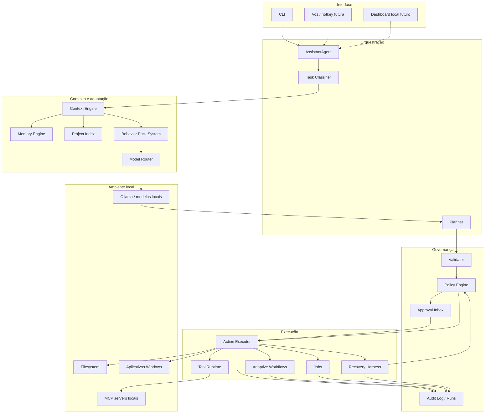
```mermaid
flowchart TB
    subgraph L1[Interface]
        cli[CLI]
        voice[Voz / hotkey futura]
        dashboard[Dashboard local futuro]
    end

    subgraph L2[Orquestração]
        agent[AssistantAgent]
        task[Task Classifier]
        planner[Planner]
    end

    subgraph L3[Contexto e adaptação]
        context[Context Engine]
        memory[Memory Engine]
        project[Project Index]
        adapter[Behavior Pack System]
        router[Model Router]
    end

    subgraph L4[Governança]
        validator[Validator]
        policy[Policy Engine]
        approvals[Approval Inbox]
        audit[Audit Log / Runs]
    end

    subgraph L5[Execução]
        executor[Action Executor]
        tools[Tool Runtime]
        workflows[Adaptive Workflows]
        jobs[Jobs]
        recovery[Recovery Harness]
    end

    subgraph L6[Ambiente local]
        ollama[Ollama / modelos locais]
        filesystem[Filesystem]
        apps[Aplicativos Windows]
        mcp[MCP servers locais]
    end

    cli --> agent
    voice -.-> agent
    dashboard -.-> agent

    agent --> task
    task --> context
    context --> memory
    context --> project
    context --> adapter
    adapter --> router
    router --> ollama
    ollama --> planner

    planner --> validator
    validator --> policy
    policy --> approvals
    approvals --> executor
    policy --> executor

    executor --> tools
    executor --> workflows
    executor --> jobs
    executor --> filesystem
    executor --> apps
    tools --> mcp

    executor --> audit
    workflows --> audit
    jobs --> audit
    recovery --> audit
    executor --> recovery
    recovery --> policy
```

### Leitura do diagrama

| Camada | Responsabilidade |
|---|---|
| Interface | Receber comandos e apresentar respostas. |
| Orquestração | Interpretar intenção e coordenar o fluxo. |
| Contexto e adaptação | Montar contexto, recuperar memórias, adaptar prompts e escolher modelo. |
| Governança | Validar plano, aplicar política, coletar aprovações e auditar. |
| Execução | Rodar ações, tools, jobs, workflows e recuperação. |
| Ambiente local | Sistema operacional, arquivos, apps, Ollama e MCP local. |

---

## 3. Fluxo principal de execução

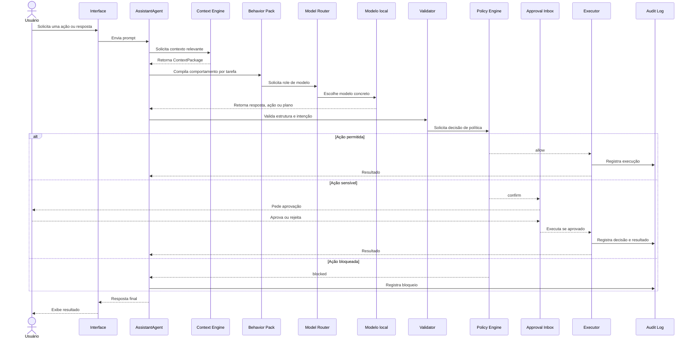
```mermaid
sequenceDiagram
    actor U as Usuário
    participant I as Interface
    participant A as AssistantAgent
    participant C as Context Engine
    participant B as Behavior Pack
    participant R as Model Router
    participant M as Modelo local
    participant V as Validator
    participant P as Policy Engine
    participant H as Approval Inbox
    participant E as Executor
    participant L as Audit Log

    U->>I: Solicita uma ação ou resposta
    I->>A: Envia prompt
    A->>C: Solicita contexto relevante
    C-->>A: Retorna ContextPackage
    A->>B: Compila comportamento por tarefa
    B->>R: Solicita role de modelo
    R->>M: Escolhe modelo concreto
    M-->>A: Retorna resposta, ação ou plano
    A->>V: Valida estrutura e intenção
    V->>P: Solicita decisão de política

    alt Ação permitida
        P-->>E: allow
        E->>L: Registra execução
        E-->>A: Resultado
    else Ação sensível
        P-->>H: confirm
        H-->>U: Pede aprovação
        U-->>H: Aprova ou rejeita
        H-->>E: Executa se aprovado
        E->>L: Registra decisão e resultado
        E-->>A: Resultado
    else Ação bloqueada
        P-->>A: blocked
        A->>L: Registra bloqueio
    end

    A-->>I: Resposta final
    I-->>U: Exibe resultado
```

---

## 4. Fronteiras de responsabilidade

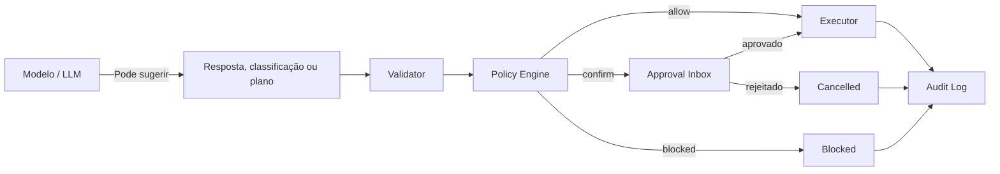
```mermaid
flowchart LR
    llm[Modelo / LLM] -->|Pode sugerir| suggestion[Resposta, classificação ou plano]
    suggestion --> validator[Validator]
    validator --> policy[Policy Engine]
    policy -->|allow| executor[Executor]
    policy -->|confirm| approval[Approval Inbox]
    policy -->|blocked| block[Blocked]
    approval -->|aprovado| executor
    approval -->|rejeitado| cancel[Cancelled]

    executor --> audit[Audit Log]
    block --> audit
    cancel --> audit
```

| Componente | Pode fazer | Não pode fazer |
|---|---|---|
| Modelo | Sugerir resposta, classificar intenção, propor plano. | Executar ação, autorizar permissão, salvar memória diretamente. |
| Behavior Pack | Orientar comportamento, prompts, exemplos e schemas. | Burlar policy ou habilitar execução. |
| Memory Engine | Extrair, classificar, persistir e recuperar memórias. | Salvar segredo ou decisão importante sem política. |
| Workflow Engine | Criar, validar, aprovar e executar workflows. | Executar script livre gerado pelo modelo. |
| Recovery Harness | Diagnosticar falha e propor recuperação segura. | Bypassar policy ou executar ação destrutiva. |
| Policy Engine | Decidir allow, confirm ou blocked. | Depender apenas de inferência semântica. |

---

## 5. Estado atual e arquitetura alvo

### Estado atual simplificado

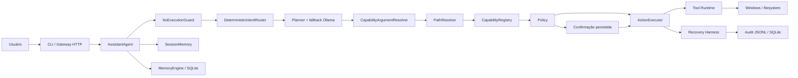
```mermaid
flowchart LR
    user[Usuário] --> cli[CLI / Gateway HTTP]
    cli --> agent[AssistantAgent]
    agent --> noexec[NoExecutionGuard]
    noexec --> intent[DeterministicIntentRouter]
    intent --> planner[Planner + fallback Ollama]
    agent --> session[SessionMemory]
    agent --> memory[MemoryEngine / SQLite]
    planner --> binder[CapabilityArgumentResolver]
    binder --> path[PathResolver]
    path --> registry[CapabilityRegistry]
    registry --> policy[Policy]
    policy --> approval[Confirmação persistida]
    policy --> executor[ActionExecutor]
    approval --> executor
    executor --> tools[Tool Runtime]
    executor --> recovery[Recovery Harness]
    tools --> os[Windows / filesystem]
    recovery --> audit[Audit JSONL / SQLite]
```

### Estado implementado após P0/P1

O runtime atual aplica guardas determinísticos antes de qualquer execução:

1. `NoExecutionGuard` intercepta pedidos como "sem executar nada" antes do
   planner e novamente antes do executor.
2. `DeterministicIntentRouter` classifica intenções operacionais de alto sinal
   antes do fallback do modelo. Shell explícito, PATH, criação/leitura de
   arquivos, busca, movimento e simulação de exclusão não dependem da
   interpretação livre do modelo.
3. `CapabilityArgumentResolver` preenche apenas argumentos seguros definidos
   pelo schema, como `root`, `source_root` e `cwd`.
4. `PathResolver` resolve caminhos relativos e marcadores como `aqui`,
   `nesta pasta` e `pasta atual` a partir de `current_cwd`, com
   `default_search_root` como fallback operacional. Memórias de usuário não
   são usadas para inventar caminhos.
5. `CapabilityRegistry` valida schema e capability antes da policy.
6. A policy decide `allow`, `confirm` ou `blocked`; confirmações são
   persistidas pelo gateway.
7. O executor retorna resultados de domínio estruturados, incluindo
   `no_results`, `invalid_path` e `permission_denied`, em vez de propagar
   exceções previsíveis como HTTP 500.

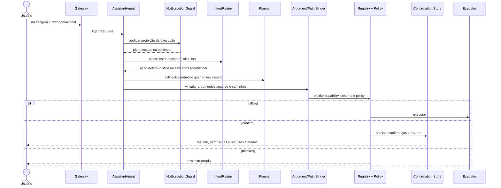
```mermaid
sequenceDiagram
    actor U as Usuário
    participant G as Gateway
    participant A as AssistantAgent
    participant N as NoExecutionGuard
    participant I as IntentRouter
    participant P as Planner
    participant B as Argument/Path Binder
    participant R as Registry + Policy
    participant C as Confirmation Store
    participant E as Executor

    U->>G: mensagem + cwd operacional
    G->>A: AgentRequest
    A->>N: verificar proibição de execução
    N-->>A: plano textual ou continuar
    A->>I: classificar intenção de alto sinal
    I-->>A: ação determinística ou sem correspondência
    A->>P: fallback semântico quando necessário
    A->>B: vincular argumentos seguros e caminhos
    B->>R: validar capability, schema e policy
    alt allow
        R->>E: executar
    else confirm
        R->>C: persistir confirmação + dry-run
        C-->>U: resumo, permissões e recursos afetados
    else blocked
        R-->>U: erro estruturado
    end
```

### Arquitetura alvo

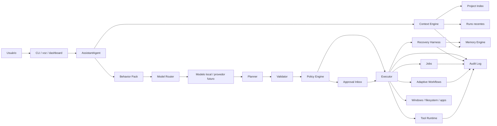
```mermaid
flowchart LR
    user[Usuário] --> interfaces[CLI / voz / dashboard]
    interfaces --> agent[AssistantAgent]

    agent --> context[Context Engine]
    context --> memory[Memory Engine]
    context --> project[Project Index]
    context --> runs[Runs recentes]

    agent --> adaptation[Behavior Pack]
    adaptation --> router[Model Router]
    router --> model[Modelo local / provedor futuro]

    model --> planner[Planner]
    planner --> validator[Validator]
    validator --> policy[Policy Engine]
    policy --> approvals[Approval Inbox]
    approvals --> executor[Executor]
    policy --> executor

    executor --> tools[Tool Runtime]
    executor --> workflows[Adaptive Workflows]
    executor --> jobs[Jobs]
    executor --> recovery[Recovery Harness]
    executor --> os[Windows / filesystem / apps]

    tools --> audit[Audit Log]
    workflows --> audit
    jobs --> audit
    recovery --> audit
    executor --> audit
    recovery --> memory
```

---

## 6. Pilares técnicos

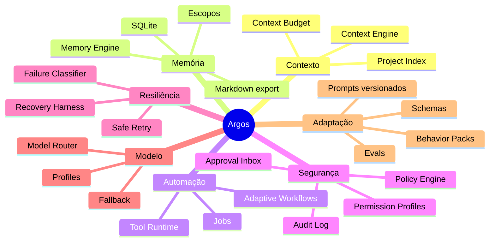
```mermaid
mindmap
  root((Argos))
    Contexto
      Context Engine
      Project Index
      Context Budget
    Memória
      Memory Engine
      SQLite
      Markdown export
      Escopos
    Automação
      Adaptive Workflows
      Jobs
      Tool Runtime
    Segurança
      Policy Engine
      Approval Inbox
      Audit Log
      Permission Profiles
    Resiliência
      Recovery Harness
      Failure Classifier
      Safe Retry
    Modelo
      Model Router
      Profiles
      Fallback
    Adaptação
      Behavior Packs
      Prompts versionados
      Schemas
      Evals
```

### 6.1 Memory Engine

O Memory Engine é responsável por transformar aprendizados úteis em memórias controladas, auditáveis e recuperáveis.

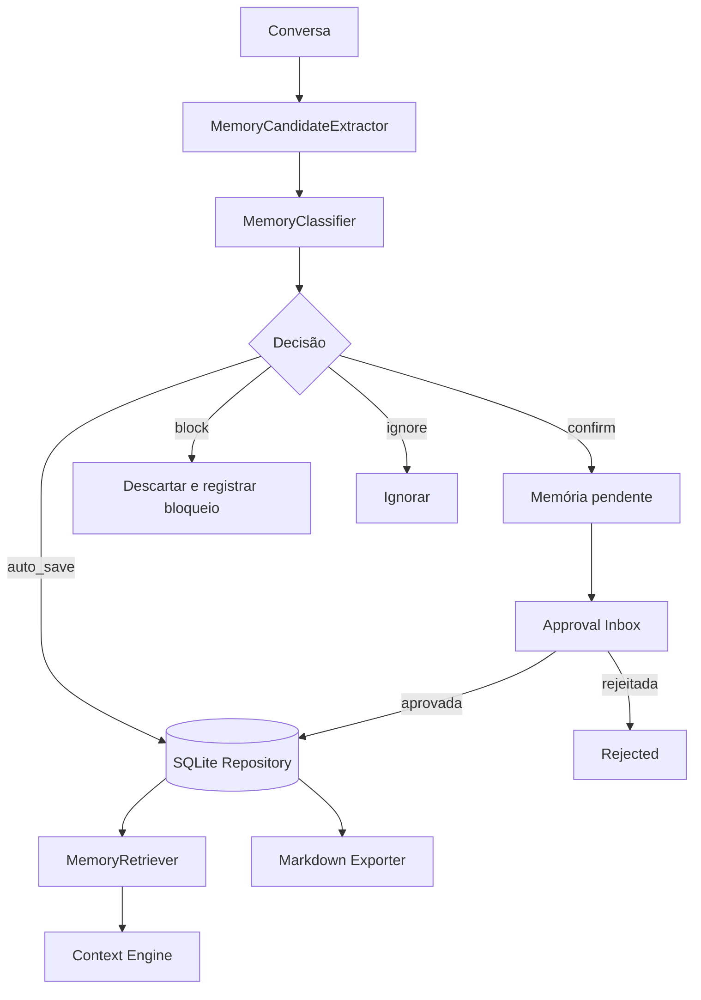
```mermaid
flowchart TD
    conversation[Conversa] --> extractor[MemoryCandidateExtractor]
    extractor --> classifier[MemoryClassifier]
    classifier --> decision{Decisão}

    decision -->|auto_save| repository[(SQLite Repository)]
    decision -->|confirm| pending[Memória pendente]
    decision -->|block| blocked[Descartar e registrar bloqueio]
    decision -->|ignore| ignored[Ignorar]

    pending --> approval[Approval Inbox]
    approval -->|aprovada| repository
    approval -->|rejeitada| rejected[Rejected]

    repository --> retriever[MemoryRetriever]
    retriever --> context[Context Engine]
    repository --> exporter[Markdown Exporter]
```

**Regras principais:**

- segredos nunca são salvos;
- decisões relevantes ficam pendentes;
- memórias possuem escopo;
- recuperação considera escopo, recência, importância e relevância;
- SQLite é a fonte primária;
- Markdown é exportação auditável.

### 6.2 Context Engine

O Context Engine decide o que o Argos deve usar agora para resolver uma tarefa.

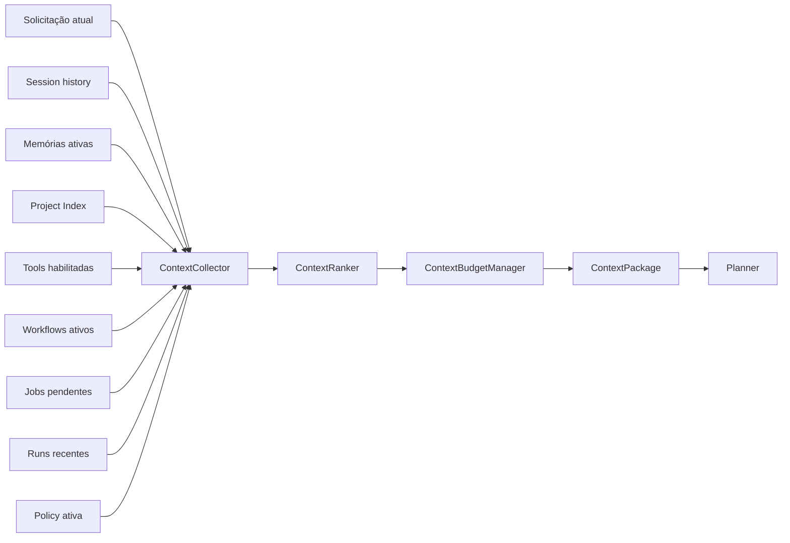
```mermaid
flowchart LR
    query[Solicitação atual] --> collector[ContextCollector]

    session[Session history] --> collector
    memory[Memórias ativas] --> collector
    project[Project Index] --> collector
    tools[Tools habilitadas] --> collector
    workflows[Workflows ativos] --> collector
    jobs[Jobs pendentes] --> collector
    runs[Runs recentes] --> collector
    policy[Policy ativa] --> collector

    collector --> ranker[ContextRanker]
    ranker --> budget[ContextBudgetManager]
    budget --> package[ContextPackage]
    package --> planner[Planner]
```

**Saída esperada:**

```text
ContextPackage:
- query
- scope
- items
- summary
- budget
- diagnostics
```

### 6.3 Adaptive Workflows

Workflows são contratos declarativos. O modelo pode propor, mas não executa diretamente.

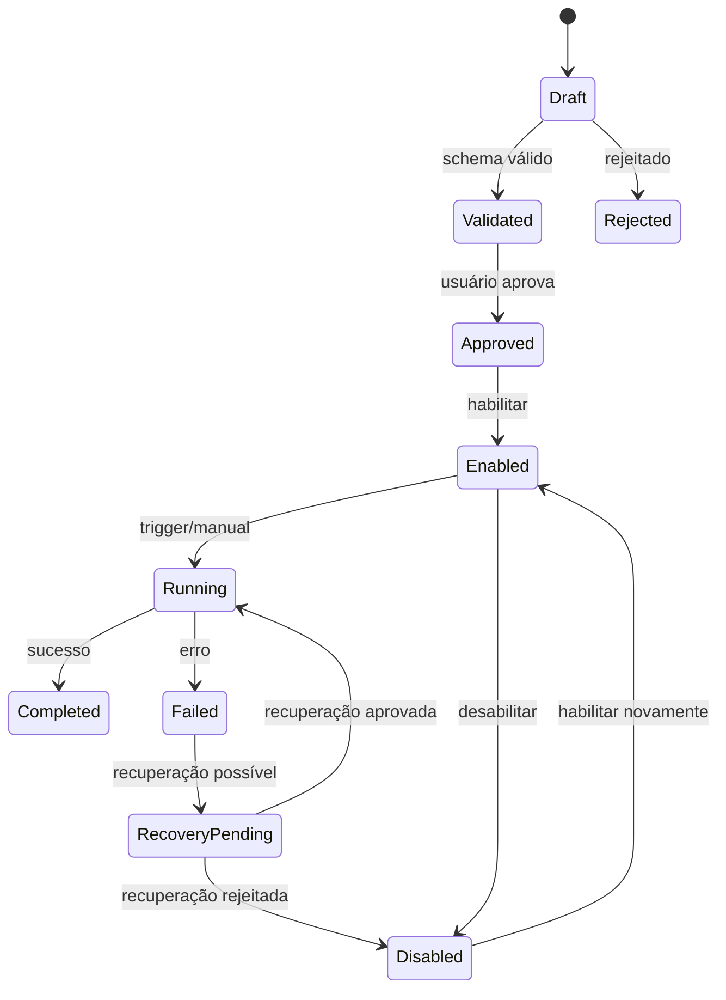
```mermaid
stateDiagram-v2
    [*] --> Draft
    Draft --> Validated: schema válido
    Draft --> Rejected: rejeitado
    Validated --> Approved: usuário aprova
    Approved --> Enabled: habilitar
    Enabled --> Running: trigger/manual
    Running --> Completed: sucesso
    Running --> Failed: erro
    Failed --> RecoveryPending: recuperação possível
    RecoveryPending --> Running: recuperação aprovada
    RecoveryPending --> Disabled: recuperação rejeitada
    Enabled --> Disabled: desabilitar
    Disabled --> Enabled: habilitar novamente
```

**Lifecycle obrigatório:**

```text
Draft -> Validated -> Approved -> Enabled -> Running -> Completed/Failed
```

### 6.4 Security, Policy and Audit

Segurança é uma camada transversal. Toda ação sensível deve passar por policy.

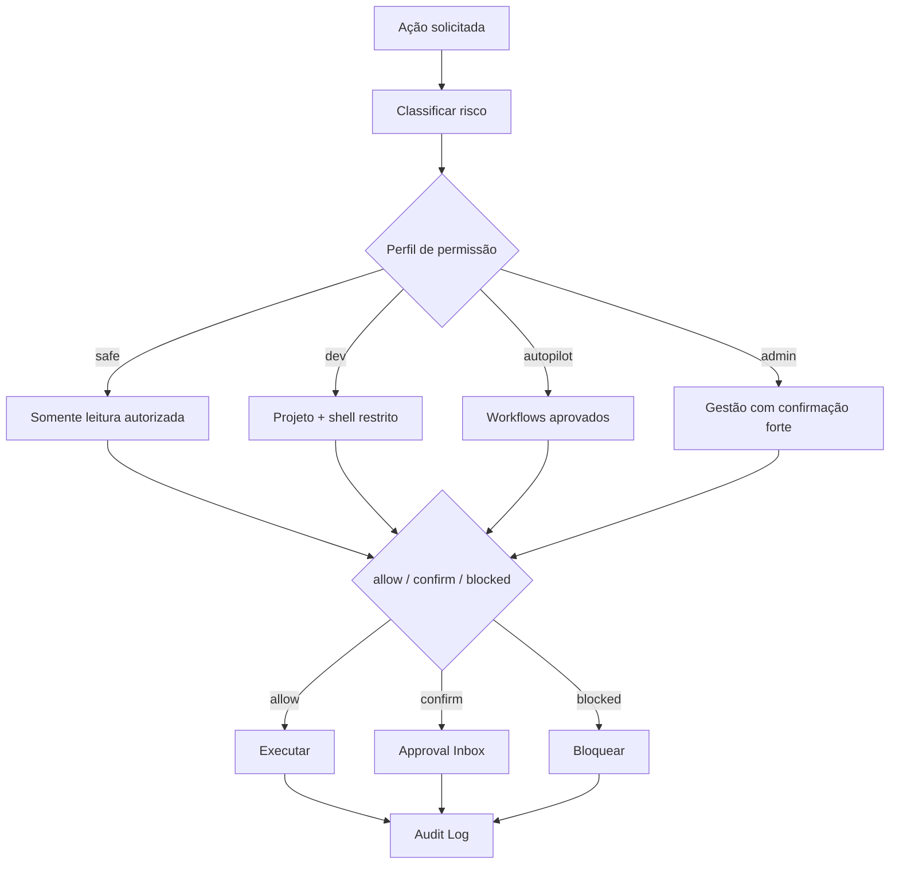
```mermaid
flowchart TD
    action[Ação solicitada] --> classify[Classificar risco]
    classify --> permission{Perfil de permissão}

    permission -->|safe| safe[Somente leitura autorizada]
    permission -->|dev| dev[Projeto + shell restrito]
    permission -->|autopilot| auto[Workflows aprovados]
    permission -->|admin| admin[Gestão com confirmação forte]

    safe --> decision{allow / confirm / blocked}
    dev --> decision
    auto --> decision
    admin --> decision

    decision -->|allow| execute[Executar]
    decision -->|confirm| approval[Approval Inbox]
    decision -->|blocked| block[Bloquear]

    execute --> audit[Audit Log]
    approval --> audit
    block --> audit
```

### 6.5 Recovery Harness

Falhas devem iniciar diagnóstico, recuperação segura e aprendizado.

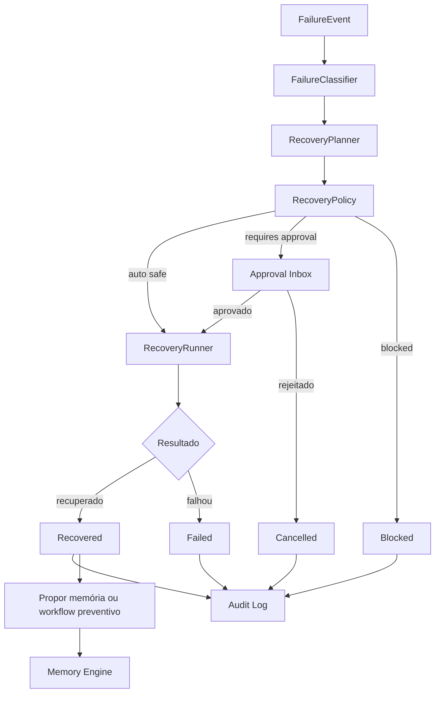
```mermaid
flowchart TD
    failure[FailureEvent] --> classify[FailureClassifier]
    classify --> plan[RecoveryPlanner]
    plan --> policy[RecoveryPolicy]

    policy -->|auto safe| runner[RecoveryRunner]
    policy -->|requires approval| approval[Approval Inbox]
    policy -->|blocked| blocked[Blocked]

    approval -->|aprovado| runner
    approval -->|rejeitado| cancelled[Cancelled]

    runner --> result{Resultado}
    result -->|recuperado| success[Recovered]
    result -->|falhou| failed[Failed]

    success --> audit[Audit Log]
    failed --> audit
    blocked --> audit
    cancelled --> audit

    success --> learning[Propor memória ou workflow preventivo]
    learning --> memory[Memory Engine]
```

### 6.6 Model Router

O Model Router escolhe modelo por tarefa, hardware e perfil.

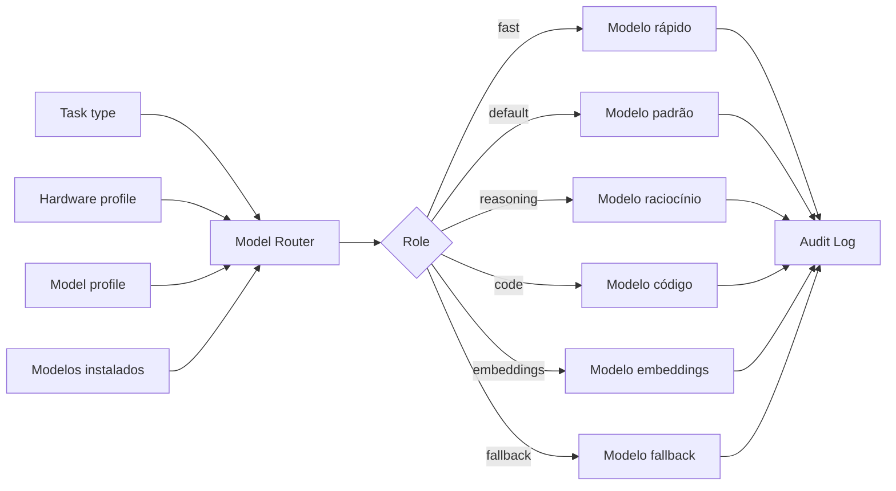
```mermaid
flowchart LR
    task[Task type] --> router[Model Router]
    hardware[Hardware profile] --> router
    profile[Model profile] --> router
    availability[Modelos instalados] --> router

    router --> role{Role}
    role -->|fast| fast[Modelo rápido]
    role -->|default| default[Modelo padrão]
    role -->|reasoning| reasoning[Modelo raciocínio]
    role -->|code| code[Modelo código]
    role -->|embeddings| embeddings[Modelo embeddings]
    role -->|fallback| fallback[Modelo fallback]

    fast --> audit[Audit Log]
    default --> audit
    reasoning --> audit
    code --> audit
    embeddings --> audit
    fallback --> audit
```

### 6.7 Behavior Pack System

Behavior Pack adapta comportamento em runtime sem autorizar execução.

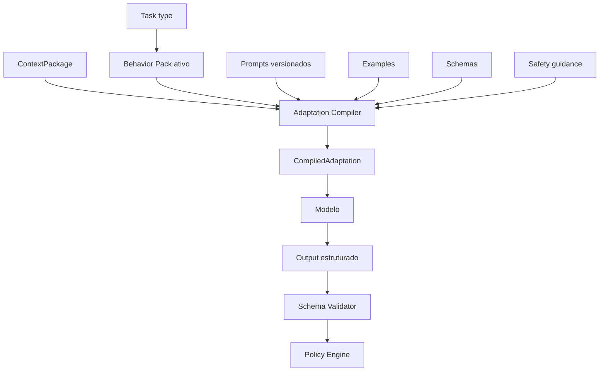
```mermaid
flowchart TD
    task[Task type] --> pack[Behavior Pack ativo]
    context[ContextPackage] --> compiler[Adaptation Compiler]
    pack --> compiler

    prompts[Prompts versionados] --> compiler
    examples[Examples] --> compiler
    schemas[Schemas] --> compiler
    guidance[Safety guidance] --> compiler

    compiler --> compiled[CompiledAdaptation]
    compiled --> model[Modelo]
    model --> output[Output estruturado]
    output --> schema[Schema Validator]
    schema --> policy[Policy Engine]
```

### 6.8 Adaptive Capability Provisioning

O LangGraph é usado somente no lifecycle de provisionamento adaptativo. Ele
não substitui o `AssistantAgent`, o planner geral, a registry, a policy ou o
executor.

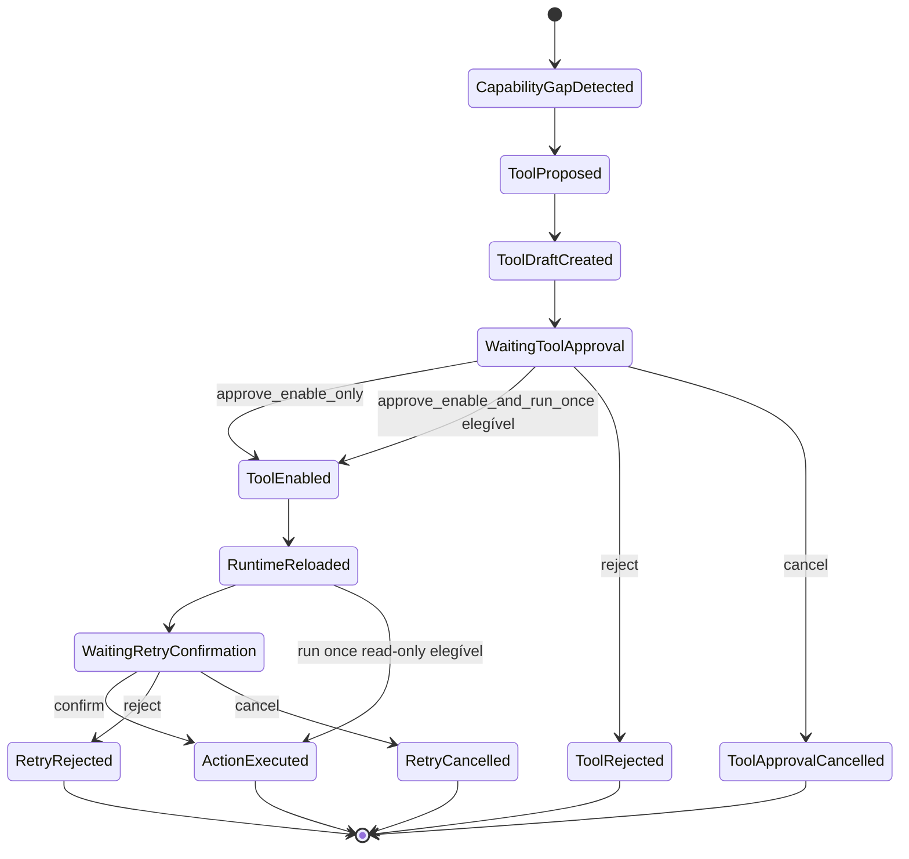
```mermaid
stateDiagram-v2
    [*] --> CapabilityGapDetected
    CapabilityGapDetected --> ToolProposed
    ToolProposed --> ToolDraftCreated
    ToolDraftCreated --> WaitingToolApproval
    WaitingToolApproval --> ToolEnabled: approve_enable_only
    WaitingToolApproval --> ToolEnabled: approve_enable_and_run_once elegível
    WaitingToolApproval --> ToolRejected: reject
    WaitingToolApproval --> ToolApprovalCancelled: cancel
    ToolEnabled --> RuntimeReloaded
    RuntimeReloaded --> WaitingRetryConfirmation
    RuntimeReloaded --> ActionExecuted: run once read-only elegível
    WaitingRetryConfirmation --> ActionExecuted: confirm
    WaitingRetryConfirmation --> RetryRejected: reject
    WaitingRetryConfirmation --> RetryCancelled: cancel
    ActionExecuted --> [*]
    ToolRejected --> [*]
    ToolApprovalCancelled --> [*]
    RetryRejected --> [*]
    RetryCancelled --> [*]
```

Regras implementadas:

- templates seguros são tentados antes da síntese model-backed;
- o modelo propõe somente `ToolDefinition` JSON estruturada;
- tools model-backed devem ser estritamente read-only, sem escrita, rede,
  subprocess ou dependências;
- validação de schema, permissões, AST e policy ocorre antes da criação do
  draft;
- o draft nasce em `ARGOS_HOME/tool-drafts`, validado e em
  `pending_approval`, nunca habilitado automaticamente;
- aprovação, instalação, enable e reload da sessão são explícitos e
  idempotentes;
- SQLite e repositórios do Argos continuam sendo fonte de verdade; o
  checkpointer LangGraph mantém apenas estado transitório redigido;
- `approve_enable_and_run_once` é revalidado pelo runtime e só vale para ação
  read-only com policy final `allow`;
- `shell.run` amplo permanece desabilitado e não dispara criação automática de
  tool pela conversa.

### 6.9 Harness integrado do gateway

Os fluxos funcionais do runtime são verificados por um harness pytest que:

- cria `ARGOS_HOME` e laboratório de arquivos temporários;
- inicia fake Ollama e gateway Uvicorn em portas isoladas;
- usa o gateway e a superfície CLI reais;
- controla aprovações e workflows pendentes;
- usa fake runner para mutações sensíveis de ambiente;
- persiste e inspeciona logs;
- falha se houver HTTP 500, traceback ASGI, efeito colateral indevido ou
  `pending_approval` renderizado como erro.

Os cenários vivem em:

```text
tests/integration/argos_gateway_harness.py
tests/integration/gateway_harness_server.py
tests/integration/test_argos_gateway_cli_flows.py
```

---

## 7. Fluxos críticos

### 7.1 Execução de ação sensível

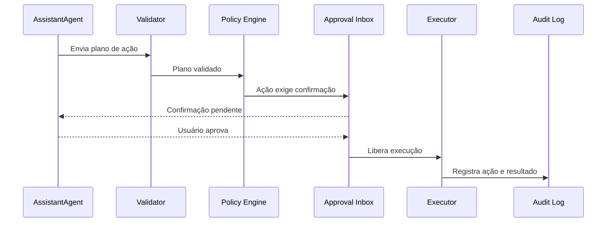
```mermaid
sequenceDiagram
    participant A as AssistantAgent
    participant V as Validator
    participant P as Policy Engine
    participant H as Approval Inbox
    participant E as Executor
    participant L as Audit Log

    A->>V: Envia plano de ação
    V->>P: Plano validado
    P->>H: Ação exige confirmação
    H-->>A: Confirmação pendente
    A-->>H: Usuário aprova
    H->>E: Libera execução
    E->>L: Registra ação e resultado
```

### 7.2 Criação de memória

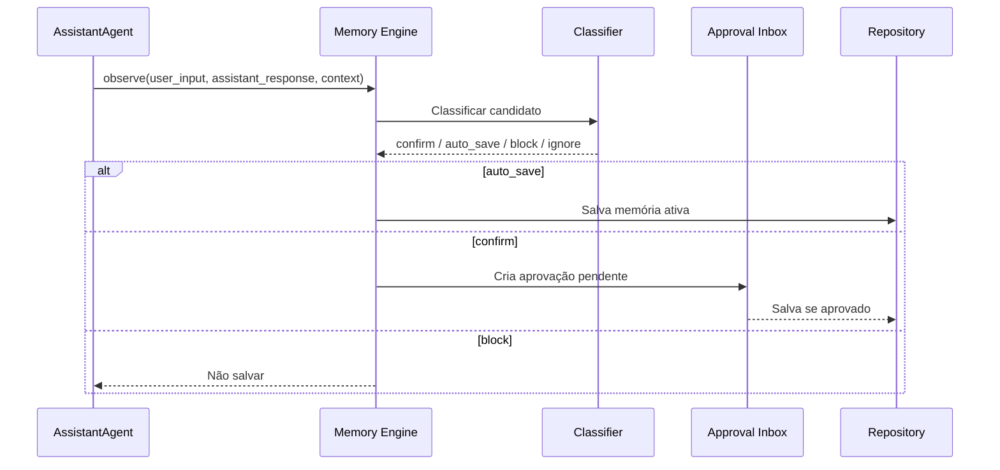
```mermaid
sequenceDiagram
    participant A as AssistantAgent
    participant ME as Memory Engine
    participant C as Classifier
    participant H as Approval Inbox
    participant R as Repository

    A->>ME: observe(user_input, assistant_response, context)
    ME->>C: Classificar candidato
    C-->>ME: confirm / auto_save / block / ignore

    alt auto_save
        ME->>R: Salva memória ativa
    else confirm
        ME->>H: Cria aprovação pendente
        H-->>R: Salva se aprovado
    else block
        ME-->>A: Não salvar
    end
```

### 7.3 Workflow declarativo

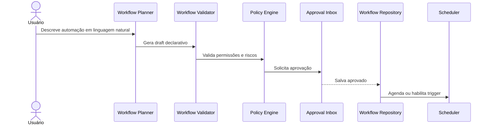
```mermaid
sequenceDiagram
    actor U as Usuário
    participant W as Workflow Planner
    participant V as Workflow Validator
    participant P as Policy Engine
    participant H as Approval Inbox
    participant R as Workflow Repository
    participant S as Scheduler

    U->>W: Descreve automação em linguagem natural
    W->>V: Gera draft declarativo
    V->>P: Valida permissões e riscos
    P->>H: Solicita aprovação
    H-->>R: Salva aprovado
    R->>S: Agenda ou habilita trigger
```

### 7.4 Recuperação de falha

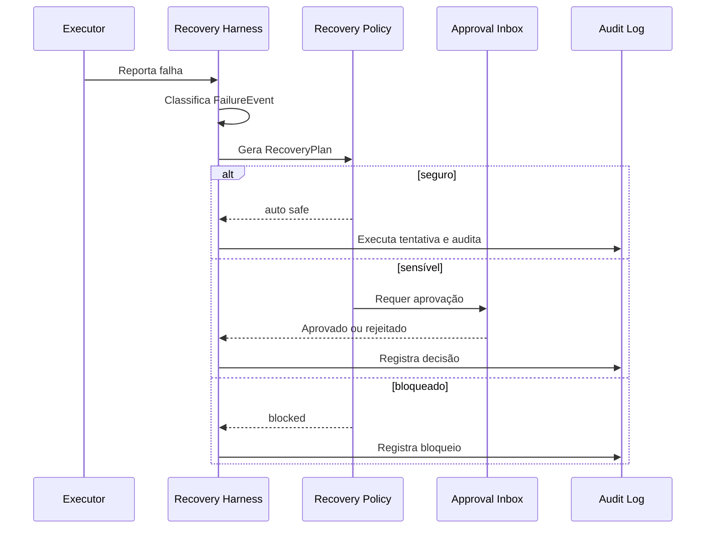
```mermaid
sequenceDiagram
    participant E as Executor
    participant RH as Recovery Harness
    participant P as Recovery Policy
    participant H as Approval Inbox
    participant L as Audit Log

    E->>RH: Reporta falha
    RH->>RH: Classifica FailureEvent
    RH->>P: Gera RecoveryPlan

    alt seguro
        P-->>RH: auto safe
        RH->>L: Executa tentativa e audita
    else sensível
        P->>H: Requer aprovação
        H-->>RH: Aprovado ou rejeitado
        RH->>L: Registra decisão
    else bloqueado
        P-->>RH: blocked
        RH->>L: Registra bloqueio
    end
```

---

## 8. Decisões de segurança

### Ações por decisão de policy

| Tipo de ação | Decisão padrão |
|---|---|
| Responder texto | allow |
| Ler contexto autorizado | allow |
| Abrir aplicativo conhecido | confirm ou allow por perfil |
| Criar arquivo | confirm |
| Editar arquivo | confirm |
| Mover arquivo | confirm |
| Executar shell genérico | blocked / unsupported no runtime atual |
| Tool local read-only validada | allow após enable explícito |
| Alterar variável de ambiente | template seguro + aprovação + confirmação |
| Instalar tool | confirm |
| Habilitar workflow | confirm |
| Salvar memória importante | confirm |
| Salvar segredo | blocked |
| Ação destrutiva | blocked por padrão |
| Bypassar policy | blocked sempre |

### Dados sensíveis bloqueados

```text
password
senha
token
secret
private_key
credential
api_key
```

---

## 9. Ciclos de vida

### 9.1 Memória

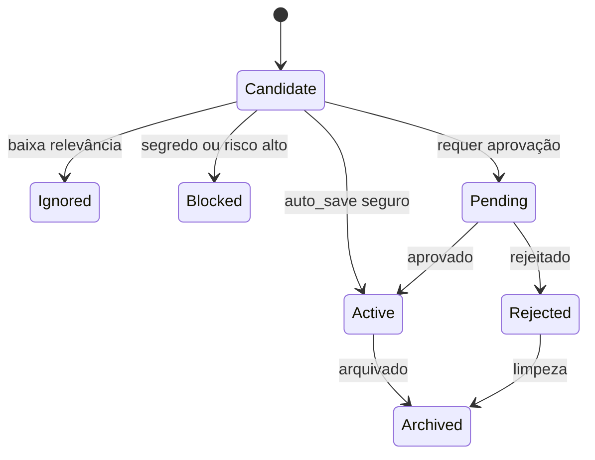
```mermaid
stateDiagram-v2
    [*] --> Candidate
    Candidate --> Ignored: baixa relevância
    Candidate --> Blocked: segredo ou risco alto
    Candidate --> Pending: requer aprovação
    Candidate --> Active: auto_save seguro
    Pending --> Active: aprovado
    Pending --> Rejected: rejeitado
    Active --> Archived: arquivado
    Rejected --> Archived: limpeza
```

### 9.2 Aprovação

```mermaid
stateDiagram-v2
    [*] --> Pending
    Pending --> Approved: usuário aprova
    Pending --> Rejected: usuário rejeita
    Pending --> Expired: timeout ou limpeza
    Approved --> Executed: ação executada
    Rejected --> Closed
    Expired --> Closed
    Executed --> Closed
```

### 9.3 Run auditável

```mermaid
stateDiagram-v2
    [*] --> Created
    Created --> Planning
    Planning --> PolicyCheck
    PolicyCheck --> WaitingApproval
    PolicyCheck --> Executing
    WaitingApproval --> Executing
    WaitingApproval --> Cancelled
    Executing --> Succeeded
    Executing --> Failed
    Failed --> RecoveryPending
    RecoveryPending --> Executing
    RecoveryPending --> FailedFinal
    Succeeded --> [*]
    Cancelled --> [*]
    FailedFinal --> [*]
```

---

## 10. Estrutura de módulos

```mermaid
flowchart TB
    src[src/assistant]

    src --> core[core]
    src --> memory[memory]
    src --> context[context]
    src --> workflows[workflows]
    src --> security[security]
    src --> recovery[recovery]
    src --> models[models]
    src --> adaptation[adaptation]
    src --> tools[tools]
    src --> gateway[gateway]
    src --> cli[cli]

    memory --> memoryFiles[models.py / engine.py / extractor.py / classifier.py / repository.py / retriever.py]
    context --> contextFiles[models.py / engine.py / collector.py / ranker.py / budget.py / project_index.py]
    workflows --> workflowFiles[models.py / engine.py / validator.py / planner.py / scheduler.py / runner.py]
    security --> securityFiles[policy.py / approvals.py / audit.py / permissions.py]
    recovery --> recoveryFiles[models.py / engine.py / classifier.py / strategies.py / runner.py]
    models --> modelFiles[router.py / profiles.py / hardware.py / benchmark.py / registry.py]
    adaptation --> adapterFiles[engine.py / pack_loader.py / prompt_registry.py / schema_registry.py / evaluator.py]
```

### Módulos operacionais atuais

```text
src/assistant/
  agent.py                         coordenação do turno e guardas finais
  planner.py                       heurísticas, fallback estruturado e validação
  intent/
    router.py                      roteamento determinístico de alto sinal
    no_execution_guard.py          bloqueio de execução e plano conceitual
    pending_resolver.py            retomada de clarificações
  capabilities/
    registry.py                    capabilities, schemas e policy base
    argument_resolver.py           binding seguro de contexto
    provisioning.py                propostas, drafts e enable
    adaptive_capability_graph.py   lifecycle LangGraph human-in-the-loop
    workflow_repository.py         estado transitório e idempotência
  files/
    path_resolver.py               resolução relativa ao cwd operacional
    resolver.py                    resolução/ambiguidade de arquivos existentes
  execution/
    executor.py                    execução e resultados de domínio
    policy.py                      allow / confirm / blocked
  recovery/                        classificação, dry-run e recuperação segura
  gateway/                         HTTP, sessões, confirmações e reload
  tools/                           catálogo, validação, instalação e runner
```

---

## 11. Critérios de evolução

A arquitetura só deve evoluir se preservar estes critérios:

| Critério | Regra |
|---|---|
| Local-first | O Argos deve funcionar localmente sempre que possível. |
| Agnóstico ao modelo | Nenhum módulo central deve depender de um modelo específico. |
| Segurança explícita | Ações sensíveis passam por policy. |
| Human-in-the-loop | Escrita, shell, instalação e workflows exigem aprovação. |
| Auditabilidade | Runs, approvals, ações e falhas precisam ser rastreáveis. |
| Sem script livre | O modelo não deve gerar código executável livre para ser rodado automaticamente. |
| Sem segredos | Segredos não entram em memória, logs, prompts, evals ou datasets. |
| Recuperação segura | Falhas podem gerar diagnóstico, mas não podem burlar policy. |
| CWD operacional | Paths relativos usam o `cwd` informado pelo runtime, nunca um usuário inferido de memória. |
| Resultados de domínio | Ausência de resultados e erros previsíveis não viram recovery destrutivo nem HTTP 500. |
| Provisionamento adaptativo | Draft automático é quarentenado; enable e execução exigem decisão humana. |
| Shell genérico | Permanece desabilitado até existir um desenho restrito e explicitamente aprovado. |
| Evolução incremental | O sistema deve funcionar primeiro sem embeddings e sem fine-tuning. |

---

## 12. Links internos recomendados

Quando estes arquivos existirem, este documento deve apontar para eles:

```text
docs/PRODUCT_VISION.md
docs/ARCHITECTURE.md
docs/SECURITY.md
docs/MEMORY_ENGINE.md
docs/CONTEXT_ENGINE.md
docs/WORKFLOWS.md
docs/RECOVERY.md
docs/MODEL_ROUTER.md
docs/BEHAVIOR_PACKS.md
```

---

## 13. Comandos técnicos de referência

```bash
argos
argos chat "abra o navegador"
argos memory list
argos workflows list
argos approvals list
argos runs list
argos safety report
argos models doctor
argos adapters list
```

---

## 14. Diretriz final

A arquitetura do Argos deve proteger uma promessa simples:

> O Argos pode usar IA para entender e sugerir, mas só deve agir quando a ação for validada, autorizada e auditável.
