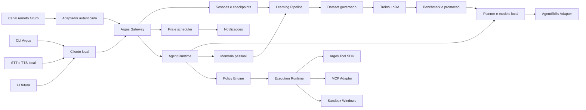
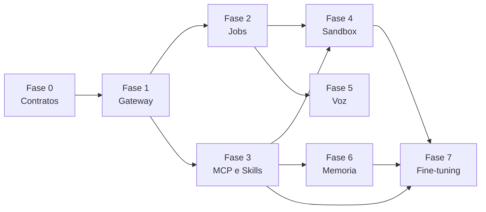

# Argos Resident Platform Roadmap

> **For agentic workers:** REQUIRED SUB-SKILL: Use superpowers:subagent-driven-development (recommended) or superpowers:executing-plans to implement this plan task-by-task. Steps use checkbox (`- [ ]`) syntax for tracking.

**Goal:** Evoluir o Argos de uma CLI local para um assistente pessoal residente, assincrono, interoperavel, adaptativo e seguro, preservando seu foco Windows-first, offline-first e independente de modelo.

**Architecture:** O processo residente `Argos Gateway` sera o unico proprietario de sessoes, memoria, fila e execucoes. CLI, voz e futuras interfaces se conectarao por uma API local autenticada; tools Argos, MCPs e skills continuarao desacoplados por adaptadores e sujeitos a uma politica central. O aprendizado sera dividido entre memoria recuperavel, melhoria de prompts e adapters versionados, evitando alterar o modelo ativo sem avaliacao e promocao controlada.

**Tech Stack:** Python 3.12, Typer, Pydantic, asyncio, SQLite, HTTP local ou named pipes, Ollama, JSON Schema, MCP, Hugging Face Transformers, TRL, PEFT/LoRA, pytest e APIs nativas do Windows.

---

## 1. Direcao do produto

O Argos deve manter um foco claro, evitando acumular canais e integracoes antes de consolidar sua experiencia local. O posicionamento recomendado e:

> Assistente pessoal Windows-first, local e offline, que aprende preferencias do usuario e executa automacoes no computador por tools portateis e controladas.

Principios:

1. O modelo planeja, mas nao acessa diretamente o sistema operacional.
2. Toda acao com efeito colateral passa por politica, permissao e auditoria.
3. CLI, voz e interfaces futuras compartilham a mesma sessao persistente.
4. Tools Argos, MCP e AgentSkills sao formatos integraveis, nao concorrentes.
5. Recursos de nuvem sao opcionais; o caminho principal deve funcionar localmente.
6. Cada fase precisa produzir software utilizavel e testavel isoladamente.
7. Produtos externos podem inspirar requisitos, mas a arquitetura e os contratos permanecem proprios do Argos.
8. Contratos internos pertencem ao Argos e integracoes externas entram por adaptadores.
9. Aprendizado automatico nunca significa promocao automatica sem testes, consentimento e rollback.
10. Memoria, prompt tuning e fine-tuning resolvem problemas diferentes e devem permanecer separados.

## 2. Alternativas avaliadas

### Abordagem A: incorporar uma plataforma externa como runtime

**Vantagem:** acesso rapido a gateway, canais, automacao e ecossistema.

**Desvantagem:** introduz Node/TypeScript como segundo runtime central, duplica memoria e politicas, reduz o controle Windows nativo e torna o Argos uma camada sobre outro produto.

**Decisao:** nao recomendada para o core.

### Abordagem B: copiar funcionalidades equivalentes

**Vantagem:** controle integral da implementacao.

**Desvantagem:** alto custo, risco de copiar complexidade sem necessidade e manutencao de protocolos proprios.

**Decisao:** usar apenas para capacidades centrais do produto.

### Abordagem C: core proprio com adaptadores abertos

**Vantagem:** preserva a proposta do Argos e permite consumir MCP, AgentSkills e futuros conectores sem acoplamento.

**Desvantagem:** exige definir contratos internos estaveis.

**Decisao:** abordagem recomendada.

## 3. Visao da arquitetura alvo

## 4. Fases de entrega

### Fase 0: contratos e observabilidade do core

**Objetivo:** preparar fronteiras estaveis antes de criar um processo residente.

**Entregas:**

- contrato `AgentRequest` e `AgentResponse`;
- identificadores de sessao, execucao e correlacao;
- eventos estruturados para planejamento, confirmacao, execucao e falha;
- configuracao versionada em `~/.argos/config.yaml`;
- migracao da montagem manual do agente para uma fabrica de runtime;
- metricas locais de latencia do modelo, planner e tools.

**Valor aplicado:**

- evita que CLI, gateway e voz criem agentes de maneiras diferentes;
- torna falhas rastreaveis;
- permite medir onde o Argos esta lento;
- reduz o risco das fases seguintes.

**Arquivos previstos:**

- Create: `src/assistant/runtime/contracts.py`
- Create: `src/assistant/runtime/factory.py`
- Create: `src/assistant/observability/events.py`
- Create: `src/assistant/observability/metrics.py`
- Modify: `src/assistant/cli.py`
- Modify: `src/assistant/config.py`
- Test: `tests/runtime/test_factory.py`
- Test: `tests/observability/test_events.py`

**Criterios de aceite:**

- a CLI continua funcionando sem alteracao de comportamento;
- toda requisicao recebe `session_id` e `run_id`;
- eventos nao armazenam conteudo sensivel por padrao;
- a suite atual permanece verde.

**Estimativa:** 3 a 5 dias.

---

### Fase 1: Argos Gateway residente

**Objetivo:** executar um unico Argos em segundo plano e permitir que diferentes clientes compartilhem estado.

**Entregas:**

- daemon local com comandos `start`, `stop`, `status` e `logs`;
- API local limitada a loopback ou named pipe;
- token local armazenado com permissao restrita ao usuario;
- gerenciamento de sessoes persistentes;
- CLI convertida em cliente do gateway, com fallback explicito para modo direto;
- endpoint de health check e informacoes de versao.

**Valor aplicado:**

- o contexto deixa de morrer ao fechar a CLI;
- habilita voz, UI e tarefas em background;
- evita carregar o modelo e o runtime repetidamente;
- reduz latencia percebida entre comandos.

**Arquivos previstos:**

- Create: `src/assistant/gateway/server.py`
- Create: `src/assistant/gateway/client.py`
- Create: `src/assistant/gateway/auth.py`
- Create: `src/assistant/gateway/process.py`
- Create: `src/assistant/sessions/repository.py`
- Modify: `src/assistant/cli.py`
- Modify: `src/assistant/config.py`
- Test: `tests/gateway/test_server.py`
- Test: `tests/gateway/test_auth.py`
- Test: `tests/gateway/test_lifecycle.py`

**Criterios de aceite:**

- duas instancias da CLI acessam a mesma sessao;
- reiniciar o cliente nao apaga o contexto;
- apenas o usuario local autenticado acessa a API;
- o gateway recupera sessoes apos reiniciar;
- `argos status` informa processo, modelo, fila e uptime.

**Estimativa:** 5 a 8 dias.

---

### Fase 1.5: contexto confiavel e recuperacao de erro

**Objetivo:** estabilizar persistencia de contexto antes de permitir jobs
assincronos, evitando que uma intencao antiga seja executada quando o usuario
mudou de assunto.

**Entregas:**

- `active_task` persistido no contexto da sessao;
- limpeza explicita de tarefa pendente quando o usuario usa marcadores como
  `esquece`, `muda de assunto`, `agora quero` ou equivalentes;
- clarificacoes do modelo sem `options` normalizadas para resposta livre;
- validacao de argumentos de tools antes da confirmacao;
- eventos de erro com `exception_type` e `run_id`, sem prompt, conteudo ou
  stack privado;
- comando `argos logs` tolerante a caracteres invalidos no terminal Windows.

**Valor aplicado:**

- reduz execucoes acidentais causadas por contexto antigo;
- impede HTTP 500 por clarificacao incompleta do modelo local;
- melhora diagnostico sem vazar dados sensiveis;
- prepara a base para checkpoints e jobs duraveis da Fase 2.

**Arquivos previstos:**

- Modify: `src/assistant/agent.py`
- Modify: `src/assistant/planner.py`
- Modify: `src/assistant/models.py`
- Modify: `src/assistant/memory/session.py`
- Modify: `src/assistant/runtime/factory.py`
- Modify: `src/assistant/gateway/service.py`
- Modify: `src/assistant/cli.py`
- Test: `tests/test_agent.py`
- Test: `tests/test_planner.py`
- Test: `tests/gateway/test_app.py`
- Test: `tests/tools/test_integration.py`

**Criterios de aceite:**

- mudar de assunto limpa a pendencia anterior;
- uma clarificacao sem opcoes nao derruba o gateway;
- tools invalidas nao chegam ao pedido de confirmacao;
- eventos de falha incluem tipo seguro da excecao e preservam o `run_id`;
- `argos logs` nao quebra por encoding do terminal.

**Status:** Concluida na entrega de contexto confiavel e recuperacao de erro.

---

### Fase 2: fila persistente, scheduler e retomada

**Objetivo:** permitir tarefas assincronas, agendadas e recuperaveis.

**Status:** Iniciada com o plano base
`docs/superpowers/plans/2026-06-07-argos-jobs-phase-2-start.md`.

**Entregas:**

- SQLite como armazenamento transacional local;
- estados `queued`, `running`, `waiting_confirmation`, `succeeded`, `failed` e `cancelled`;
- scheduler para execucao unica e recorrente;
- retry com backoff apenas para erros classificados como transitorios;
- checkpoints entre etapas;
- cancelamento cooperativo;
- comandos `jobs list`, `show`, `cancel`, `retry` e `schedule`;
- notificacao local ao concluir ou falhar.

**Valor aplicado:**

- transforma o Argos em assistente assincrono real;
- tarefas continuam mesmo sem terminal aberto;
- falhas nao exigem recomecar workflows inteiros;
- o usuario consegue auditar e controlar trabalho pendente.

**Arquivos previstos:**

- Create: `src/assistant/jobs/models.py`
- Create: `src/assistant/jobs/repository.py`
- Create: `src/assistant/jobs/queue.py`
- Create: `src/assistant/jobs/scheduler.py`
- Create: `src/assistant/jobs/worker.py`
- Create: `src/assistant/jobs/recovery.py`
- Modify: `src/assistant/gateway/server.py`
- Modify: `src/assistant/cli.py`
- Test: `tests/jobs/test_repository.py`
- Test: `tests/jobs/test_scheduler.py`
- Test: `tests/jobs/test_recovery.py`

**Criterios de aceite:**

- jobs sobrevivem ao reinicio do gateway;
- jobs nao sao executados duas vezes apos recuperacao;
- confirmacoes pausam sem bloquear o worker;
- tarefas podem ser canceladas e consultadas;
- recorrencias usam timezone configuravel;
- retries possuem limite e motivo registrado.

**Estimativa:** 7 a 10 dias.

---

### Fase 3: interoperabilidade com MCP e AgentSkills

**Objetivo:** aproveitar ecossistemas existentes sem substituir o Tool SDK.

**Entregas:**

- interface interna `CapabilityProvider`;
- adaptadores `ArgosToolProvider` e `McpToolProvider`;
- descoberta e cache de schemas MCP;
- configuracao de servidores MCP locais;
- timeouts, politica e auditoria uniformes para MCP;
- loader de skills no formato `SKILL.md`;
- precedencia `workspace > usuario > bundled`;
- diagnostico de conflitos entre tools e skills.

**Valor aplicado:**

- permite reutilizar integracoes prontas do mercado;
- evita que o Argos vire um ecossistema isolado;
- mantem o controle de seguranca e auditoria do Argos;
- facilita portar conhecimento entre ambientes compativeis com AgentSkills.

**Arquivos previstos:**

- Create: `src/assistant/providers/base.py`
- Create: `src/assistant/providers/argos_tools.py`
- Create: `src/assistant/providers/mcp.py`
- Create: `src/assistant/mcp/config.py`
- Create: `src/assistant/mcp/transport.py`
- Modify: `src/assistant/mcp/client.py`
- Modify: `src/assistant/skills/loader.py`
- Modify: `src/assistant/planner.py`
- Test: `tests/providers/test_catalog.py`
- Test: `tests/mcp/test_provider.py`
- Test: `tests/skills/test_precedence.py`

**Criterios de aceite:**

- planner recebe um catalogo uniforme de capacidades;
- MCP passa pela mesma confirmacao das tools locais;
- servidor MCP indisponivel nao derruba o agente;
- skills incompativeis geram diagnostico legivel;
- tools Argos existentes continuam funcionando.

**Estimativa:** 6 a 9 dias.

---

### Fase 4: sandbox e cadeia de confianca

**Objetivo:** tornar permissoes de tools tecnicamente aplicadas, nao apenas declaradas.

**Entregas:**

- limites de CPU, memoria, processos filhos e tempo por Windows Job Objects;
- diretorio de trabalho descartavel;
- allowlist de caminhos montados para leitura e escrita;
- execucao sob identidade restrita quando suportado;
- bloqueio de rede por perfil;
- assinatura ou hash confiavel de pacotes;
- verificacao antes de cada execucao;
- quarentena e rollback de versoes;
- modo Docker opcional para desenvolvimento multiplataforma.

**Valor aplicado:**

- reduz o impacto de tools defeituosas ou maliciosas;
- torna o marketplace futuro viavel;
- diferencia o Argos de frameworks que executam plugins no processo principal;
- aumenta confianca para automacoes com dados pessoais.

**Arquivos previstos:**

- Create: `src/assistant/sandbox/base.py`
- Create: `src/assistant/sandbox/windows_job.py`
- Create: `src/assistant/sandbox/filesystem.py`
- Create: `src/assistant/sandbox/network.py`
- Create: `src/assistant/tools/trust.py`
- Modify: `src/assistant/tools/runner.py`
- Modify: `src/assistant/tools/installer.py`
- Modify: `src/assistant/tools/state.py`
- Test: `tests/sandbox/test_limits.py`
- Test: `tests/sandbox/test_filesystem.py`
- Test: `tests/tools/test_trust.py`

**Criterios de aceite:**

- tool sem permissao nao grava fora do escopo autorizado;
- timeout encerra tambem processos filhos;
- pacote alterado depois da aprovacao e bloqueado;
- versao quebrada pode voltar para a ultima versao valida;
- falha da sandbox resulta em bloqueio, nunca em execucao irrestrita.

**Estimativa:** 10 a 15 dias.

---

### Fase 5: voz local e experiencia residente

**Objetivo:** permitir acionar e acompanhar o Argos sem manter a CLI aberta.

**Entregas:**

- push-to-talk ou hotkey global como primeira versao;
- STT local desacoplado por provider;
- TTS local desacoplado por provider;
- notificacoes do Windows;
- indicador de escuta, processamento, confirmacao e execucao;
- interrupcao de fala;
- confirmacao por voz apenas para acoes de risco baixo;
- fallback visual para confirmacoes sensiveis.

**Valor aplicado:**

- concretiza a proposta de assistente pessoal;
- reduz friccao em tarefas recorrentes;
- reutiliza gateway, sessoes e jobs construidos;
- mantem processamento de voz local.

**Arquivos previstos:**

- Create: `src/assistant/voice/contracts.py`
- Create: `src/assistant/voice/stt.py`
- Create: `src/assistant/voice/tts.py`
- Create: `src/assistant/voice/hotkey.py`
- Create: `src/assistant/notifications/windows.py`
- Modify: `src/assistant/gateway/server.py`
- Test: `tests/voice/test_turn_manager.py`
- Test: `tests/voice/test_confirmation_policy.py`

**Criterios de aceite:**

- hotkey inicia e encerra uma captura;
- audio pode permanecer totalmente local;
- o usuario consegue interromper resposta;
- acoes destrutivas exigem confirmacao visual;
- voz e CLI compartilham contexto.

**Estimativa:** 7 a 12 dias.

---

### Fase 6: memoria pessoal governada

**Objetivo:** transformar correcoes e preferencias em aprendizado recuperavel sem retreinar o modelo para fatos pessoais que mudam com frequencia.

**Entregas:**

- tipos de memoria: preferencia, correcao, fato pessoal e procedimento;
- extracao de candidatos pelo modelo;
- deduplicacao e atualizacao semantica;
- confirmacao antes de persistir;
- ranking hibrido lexical e vetorial;
- origem, data, confianca e validade;
- comandos para listar, editar, esquecer e exportar;
- avaliacao automatizada de recuperacao.

**Valor aplicado:**

- o Argos melhora com o uso sem fine-tuning constante;
- reduz repeticao de instrucoes;
- mantem conhecimento legivel e controlavel pelo usuario;
- evita memorias contraditorias ou invisiveis.

**Arquivos previstos:**

- Create: `src/assistant/memory/models.py`
- Create: `src/assistant/memory/candidates.py`
- Create: `src/assistant/memory/index.py`
- Create: `src/assistant/memory/governance.py`
- Modify: `src/assistant/memory/long_term.py`
- Modify: `src/assistant/agent.py`
- Modify: `src/assistant/cli.py`
- Test: `tests/memory/test_candidates.py`
- Test: `tests/memory/test_governance.py`
- Test: `tests/memory/test_retrieval.py`

**Criterios de aceite:**

- nenhuma memoria nova e salva silenciosamente;
- correcoes substituem ou relacionam registros antigos;
- o usuario pode explicar por que uma memoria foi recuperada;
- dados podem ser exportados e apagados;
- benchmark mede precisao de recuperacao.

**Estimativa:** 7 a 10 dias.

---

### Fase 7: aprendizado adaptativo e fine-tuning governado

**Objetivo:** aprender padroes recorrentes das conversas e melhorar comportamento, uso de tools e estilo por meio de adapters locais versionados.

**Premissa de seguranca:** a automacao cobre coleta consentida, sanitizacao, curadoria, treino, avaliacao e recomendacao. Um novo adapter somente se torna ativo quando supera os criterios configurados e recebe aprovacao do usuario.

**Entregas:**

- consentimento explicito e configuracao por categoria de dado;
- captura de sinais: correcao, resposta aceita, tarefa concluida, tool correta e falha recuperada;
- exclusao de segredos, credenciais, tokens, documentos privados e dados marcados como nao treinaveis;
- dataset conversacional versionado em JSONL;
- exemplos de tool calling com mensagens, chamadas, resultados e schemas;
- separacao deterministica entre treino, validacao e teste;
- deduplicacao, balanceamento e pontuacao de qualidade;
- pipeline local de SFT com TRL e adapters PEFT/LoRA;
- perfis de treino por capacidade de hardware;
- benchmark comportamental, de tools, seguranca e regressao;
- registro de experimentos, dataset, modelo base, template e hiperparametros;
- promocao `candidate -> canary -> active -> retired`;
- teste A/B local opcional entre modelo base e adapter;
- rollback imediato para o modelo anterior;
- comandos `learning status`, `dataset review`, `train`, `evaluate`, `promote` e `rollback`.

**Valor aplicado:**

- melhora o Argos com exemplos reais do usuario sem treinar todos os parametros;
- especializa o modelo pequeno em comandos, linguagem e tools do proprio Argos;
- reduz dependencia de heuristicas fixas no codigo;
- permite experimentar sem destruir a versao estavel;
- cria um ativo tecnico proprio: dataset e benchmarks do assistente desktop.

**Arquivos previstos:**

- Create: `src/assistant/learning/models.py`
- Create: `src/assistant/learning/consent.py`
- Create: `src/assistant/learning/signals.py`
- Create: `src/assistant/learning/redaction.py`
- Create: `src/assistant/learning/dataset.py`
- Create: `src/assistant/learning/curation.py`
- Create: `src/assistant/learning/training.py`
- Create: `src/assistant/learning/evaluation.py`
- Create: `src/assistant/learning/registry.py`
- Create: `src/assistant/learning/promotion.py`
- Modify: `src/assistant/agent.py`
- Modify: `src/assistant/planner.py`
- Modify: `src/assistant/cli.py`
- Test: `tests/learning/test_consent.py`
- Test: `tests/learning/test_redaction.py`
- Test: `tests/learning/test_dataset.py`
- Test: `tests/learning/test_evaluation.py`
- Test: `tests/learning/test_promotion.py`

**Criterios de aceite:**

- treinamento permanece desabilitado por padrao;
- conversas sem consentimento nunca entram no dataset;
- cada amostra informa origem, consentimento, versao e motivo de selecao;
- secrets conhecidos sao removidos antes de gravar o dataset;
- split de teste nao contem duplicatas ou continuacoes do treino;
- adapter candidato nao substitui o ativo sem superar os limites de qualidade e seguranca;
- regressao em tool calling, recusas ou comandos destrutivos bloqueia promocao;
- usuario consegue excluir uma conversa e reconstruir datasets futuros sem ela;
- modelo base e adapters podem ser restaurados sem reinstalar o Argos.

**Estrategia tecnica inicial:**

- SFT conversacional com perda apenas nas respostas do assistente;
- LoRA como primeira tecnica para reduzir VRAM, tempo e tamanho dos artefatos;
- adapter separado por modelo base e template de chat;
- treino manual sob demanda no primeiro release;
- agendamento automatico somente depois de tres ciclos manuais validados;
- inferencia canario limitada a uma porcentagem configuravel de conversas;
- nenhum treinamento enquanto o computador estiver em bateria ou acima do limite termico configurado.

**Estimativa:** 12 a 20 dias para o primeiro pipeline governado.

## 5. Sequencia recomendada

Ordem de execucao:

1. Fase 0: estabilizar contratos.
2. Fase 1: criar o processo residente.
3. Fase 2: entregar assincronia e agendamento.
4. Fase 3: abrir o ecossistema via MCP e AgentSkills.
5. Fase 4: reforcar seguranca antes de ampliar distribuicao de tools.
6. Fase 6: consolidar memoria e sinais de aprendizado antes do treino.
7. Fase 7: introduzir fine-tuning governado depois de datasets, benchmarks e sandbox.
8. Fase 5 pode prosseguir em paralelo com as fases 6 e 7 depois do gateway.

## 6. Marcos de produto

### Marco A: Argos sempre disponivel

Composto pelas fases 0 e 1.

**Demonstracao:** fechar e reabrir a CLI preservando sessao e modelo aquecido.

### Marco B: Argos trabalha sem terminal

Composto pela fase 2.

**Demonstracao:** agendar uma tarefa, fechar a CLI e receber notificacao ao concluir.

### Marco C: Argos usa o ecossistema

Composto pela fase 3.

**Demonstracao:** conectar um MCP local e usa-lo com politica e auditoria do Argos.

### Marco D: Argos executa tools com isolamento reforcado

Composto pela fase 4.

**Demonstracao:** uma tool de teste tenta sair do diretorio permitido e e bloqueada.

### Marco E: Argos pessoal

Composto pelas fases 5 e 6.

**Demonstracao:** iniciar por hotkey, usar uma preferencia salva e concluir uma tarefa em background.

### Marco F: Argos adaptativo

Composto pela fase 7.

**Demonstracao:** transformar correcoes consentidas em dataset, treinar um adapter local, comparar com o modelo ativo e promover ou rejeitar o candidato com evidencias.

## 7. Metricas de sucesso

- tempo de resposta inicial e subsequente;
- percentual de jobs concluidos, retomados e cancelados corretamente;
- percentual de confirmacoes desnecessarias;
- taxa de selecao correta de tool;
- falhas de MCP isoladas sem queda do gateway;
- tentativas de violacao bloqueadas pela sandbox;
- precisao de recuperacao de memoria;
- consumo de RAM ocioso e durante inferencia;
- percentual de fluxos concluidos totalmente offline.
- percentual de conversas elegiveis com consentimento valido;
- taxa de remocao de dados sensiveis antes do dataset;
- ganho do adapter sobre o baseline por benchmark;
- taxa de regressao e rollback de adapters;
- tempo, VRAM e energia consumidos por ciclo de treino.

## 8. Riscos e mitigacoes

| Risco | Impacto | Mitigacao |
|---|---|---|
| Gateway aumentar complexidade cedo | Alto | API minima e SQLite antes de frameworks distribuidos |
| Duplicar padroes MCP | Alto | Adaptador sobre contrato interno, sem novo protocolo externo |
| Permissoes declarativas criarem falsa seguranca | Alto | Comunicar limites e priorizar Fase 4 |
| Voz gerar comandos ambiguos | Alto | Push-to-talk primeiro e confirmacao visual para risco |
| Memoria acumular erros | Alto | Candidatos, confirmacao, proveniencia e exclusao |
| Fine-tuning aprender informacao privada ou respostas ruins | Alto | Opt-in, redacao, curadoria, dataset versionado e promocao bloqueada por benchmark |
| Adapter degradar capacidades gerais | Alto | Baseline fixo, testes de regressao, canario e rollback |
| Treino local sobrecarregar a maquina | Medio | LoRA, perfis de hardware, limites termicos e execucao agendada |
| Modelo pequeno selecionar tool errada | Medio | schemas curtos, pre-filtro e benchmarks locais |
| Crescimento de dependencias | Medio | providers opcionais e core minimo |

## 9. Itens fora do escopo inicial

- marketplace publico de tools;
- WhatsApp, Telegram, Slack e dezenas de canais;
- aplicativo movel;
- multiagente autonomo;
- execucao distribuida em varias maquinas;
- compatibilidade com formatos proprietarios de plugins;
- treinamento integral de todos os parametros do modelo no computador pessoal;
- promocao silenciosa de modelos ou adapters sem avaliacao;
- envio de conversas para servicos externos de treinamento por padrao;
- instalacao automatica de codigo gerado sem aprovacao.

## 10. Decisoes solicitadas na revisao

1. Confirmar o posicionamento Windows-first e offline-first.
2. Confirmar que o gateway residente e a proxima entrega.
3. Confirmar SQLite como armazenamento local inicial.
4. Confirmar MCP e AgentSkills como integracoes prioritarias.
5. Confirmar que canais remotos e marketplace permanecem fora do escopo.
6. Confirmar a ordem memoria -> dataset -> fine-tuning para reduzir risco de aprendizado incorreto.
7. Confirmar que treinamento e coleta sao opt-in e que promocao continua governada.
8. Definir se a Fase 6 de memoria deve preceder a Fase 5 de voz.

## 11. Plano de desenvolvimento iniciado

O plano tecnico detalhado da **Fase 0 + Fase 1** esta em `docs/superpowers/plans/2026-06-06-argos-runtime-gateway.md`, com TDD, comandos de verificacao, migracao da CLI e commits incrementais. As demais fases receberao planos proprios quando suas dependencias estiverem concluidas.

## 12. Referencias tecnicas

- TRL SFT Trainer: datasets conversacionais, perda apenas nas respostas do assistente e exemplos de tool calling.
- Hugging Face PEFT: adapters LoRA leves, versionaveis e substituiveis.
- Transformers chat templates: preservacao do formato de conversa esperado pelo modelo base.
- Ollama import: empacotamento posterior do modelo ou adapter compativel para inferencia local.
