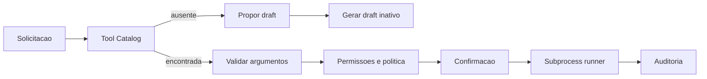

# Argos Tool SDK Implementation Plan

> **For agentic workers:** REQUIRED SUB-SKILL: Use superpowers:subagent-driven-development (recommended) or superpowers:executing-plans to implement this plan task-by-task. Steps use checkbox (`- [ ]`) syntax for tracking.

**Goal:** Construir um SDK de tools locais com contrato portatil, descoberta dinamica, lifecycle seguro, execucao controlada e geracao de drafts nao executaveis.

**Architecture:** O pacote `assistant.tools` separa manifesto, validacao, estado, catalogo, instalacao, runner, auditoria e geracao. O planner recebe apenas tools habilitadas, enquanto o agente converte chamadas em uma politica efetiva antes de executar um subprocesso JSON isolado por `venv`.

**Tech Stack:** Python 3.12, Pydantic, PyYAML, jsonschema, pathlib, subprocess, venv, hashlib, ast, pytest.

---

## Estrutura de arquivos

```text
src/assistant/tools/
├── __init__.py
├── models.py
├── schemas.py
├── manifest.py
├── validator.py
├── state.py
├── catalog.py
├── permissions.py
├── audit.py
├── runner.py
├── installer.py
├── generator.py
└── bootstrap.py

tools/
└── local.spring.create_project/
    ├── tool.yaml
    ├── handler.py
    ├── requirements.lock
    └── tests/test_handler.py
```

### Task 1: Modelos e meta-schema do SDK

**Files:**
- Modify: `pyproject.toml`
- Create: `src/assistant/tools/__init__.py`
- Create: `src/assistant/tools/models.py`
- Create: `src/assistant/tools/schemas.py`
- Test: `tests/tools/test_models.py`

- [ ] **Step 1: Criar testes dos modelos**

```python
from assistant.tools.models import ToolManifest, ToolPermissions


def test_tool_manifest_parses_minimal_valid_contract():
    manifest = ToolManifest.model_validate({
        "schema_version": "1.0",
        "name": "local.echo",
        "version": "1.0.0",
        "title": "Echo",
        "description": "Retorna o texto informado.",
        "runtime": {
            "type": "python",
            "python": ">=3.12,<3.13",
            "entrypoint": "handler.py",
        },
        "input_schema": {
            "$schema": "https://json-schema.org/draft/2020-12/schema",
            "type": "object",
            "additionalProperties": False,
        },
        "output_schema": {
            "$schema": "https://json-schema.org/draft/2020-12/schema",
            "type": "object",
            "additionalProperties": False,
        },
        "permissions": {
            "filesystem": {"read": [], "write": []},
            "network": {"enabled": False, "hosts": []},
            "subprocess": {"executables": []},
        },
        "execution": {"timeout_seconds": 30, "max_output_bytes": 65536},
    })

    assert manifest.name == "local.echo"
    assert manifest.permissions == ToolPermissions()
```

- [ ] **Step 2: Executar o teste vermelho**

Run: `python -m pytest tests/tools/test_models.py -q`

Expected: FAIL com `ModuleNotFoundError: assistant.tools`.

- [ ] **Step 3: Adicionar dependencia e modelos estritos**

Adicionar em `pyproject.toml`:

```toml
"jsonschema>=4.23.0",
```

Implementar modelos Pydantic com `ConfigDict(extra="forbid")`, incluindo:

```python
class ToolExecution(BaseModel):
    model_config = ConfigDict(extra="forbid")
    timeout_seconds: int = Field(ge=1, le=300)
    max_output_bytes: int = Field(ge=1024, le=10_485_760)


class ToolManifest(BaseModel):
    model_config = ConfigDict(extra="forbid")
    schema_version: Literal["1.0"]
    name: str = Field(pattern=r"^[a-z][a-z0-9]*(?:\.[a-z][a-z0-9_]*)+$")
    version: str = Field(pattern=r"^(0|[1-9]\d*)\.(0|[1-9]\d*)\.(0|[1-9]\d*)$")
```

- [ ] **Step 4: Executar os testes**

Run: `python -m pytest tests/tools/test_models.py -q`

Expected: PASS.

- [ ] **Step 5: Commit**

```powershell
git add pyproject.toml src/assistant/tools tests/tools/test_models.py
git commit -m "feat: add tool SDK contract models"
```

### Task 2: Loader e validacao de manifesto

**Files:**
- Create: `src/assistant/tools/manifest.py`
- Create: `src/assistant/tools/validator.py`
- Test: `tests/tools/test_manifest.py`
- Test: `tests/tools/test_validator.py`

- [ ] **Step 1: Criar fixtures e testes de carregamento seguro**

```python
def test_manifest_loader_rejects_unknown_fields(tmp_path):
    tool_dir = write_tool_fixture(tmp_path, extra_manifest={"unexpected": True})

    with pytest.raises(ToolManifestError, match="unexpected"):
        load_tool_manifest(tool_dir)


def test_manifest_loader_rejects_entrypoint_traversal(tmp_path):
    tool_dir = write_tool_fixture(
        tmp_path,
        runtime={"type": "python", "python": ">=3.12,<3.13", "entrypoint": "../evil.py"},
    )

    with pytest.raises(ToolManifestError, match="entrypoint"):
        load_tool_manifest(tool_dir)
```

- [ ] **Step 2: Executar os testes vermelhos**

Run: `python -m pytest tests/tools/test_manifest.py tests/tools/test_validator.py -q`

Expected: FAIL por modulos ausentes.

- [ ] **Step 3: Implementar loader**

Usar `yaml.safe_load`, exigir mapping e resolver o entrypoint com `Path.resolve()`. O caminho final deve permanecer dentro de `tool_dir`.

- [ ] **Step 4: Implementar validacao JSON Schema e AST**

Usar:

```python
Draft202012Validator.check_schema(manifest.input_schema)
Draft202012Validator.check_schema(manifest.output_schema)
```

O validador AST deve produzir findings para:

```python
BLOCKED_CALLS = {"eval", "exec", "compile", "__import__"}
BLOCKED_IMPORTS = {"ctypes"}
```

Tambem deve detectar `subprocess` com `shell=True`, imports dinamicos e entrypoint ausente.

- [ ] **Step 5: Executar os testes**

Run: `python -m pytest tests/tools/test_manifest.py tests/tools/test_validator.py -q`

Expected: PASS.

- [ ] **Step 6: Commit**

```powershell
git add src/assistant/tools/manifest.py src/assistant/tools/validator.py tests/tools
git commit -m "feat: validate tool manifests and source"
```

### Task 3: Lifecycle e integridade

**Files:**
- Create: `src/assistant/tools/state.py`
- Test: `tests/tools/test_state.py`

- [ ] **Step 1: Criar testes de transicao**

```python
def test_tool_state_rejects_skipping_approval(tmp_path):
    store = ToolStateStore(tmp_path / "tool-state.json")
    store.register_draft("local.echo", "1.0.0", hashes={"handler.py": "abc"})

    with pytest.raises(InvalidToolTransition):
        store.transition("local.echo", "1.0.0", "installed")


def test_changed_hash_marks_installed_tool_broken(tmp_path):
    store = ToolStateStore(tmp_path / "tool-state.json")
    seed_enabled_tool(store)

    record = store.verify_integrity(
        "local.echo",
        "1.0.0",
        current_hashes={"handler.py": "changed"},
    )

    assert record.state == "broken"
```

- [ ] **Step 2: Executar os testes vermelhos**

Run: `python -m pytest tests/tools/test_state.py -q`

Expected: FAIL por modulo ausente.

- [ ] **Step 3: Implementar maquina de estados**

Transicoes permitidas:

```python
ALLOWED_TRANSITIONS = {
    "draft": {"validating", "rejected"},
    "validating": {"validated", "rejected"},
    "validated": {"approved", "rejected"},
    "approved": {"installed", "rejected"},
    "installed": {"enabled", "disabled", "broken"},
    "enabled": {"disabled", "broken"},
    "disabled": {"enabled", "broken"},
    "broken": {"validated", "rejected"},
}
```

Persistir por escrita atomica em arquivo temporario seguida de `replace`.

- [ ] **Step 4: Implementar hashes**

Calcular SHA-256 de `tool.yaml`, `handler.py` e `requirements.lock`. Alteracao posterior invalida aprovacao e marca `broken`.

- [ ] **Step 5: Executar os testes e commit**

Run: `python -m pytest tests/tools/test_state.py -q`

Expected: PASS.

```powershell
git add src/assistant/tools/state.py tests/tools/test_state.py
git commit -m "feat: add tool lifecycle and integrity state"
```

### Task 4: Catalogo dinamico e bloqueio de desconhecidas

**Files:**
- Create: `src/assistant/tools/catalog.py`
- Modify: `src/assistant/capabilities/registry.py`
- Modify: `src/assistant/execution/policy.py`
- Test: `tests/tools/test_catalog.py`
- Test: `tests/test_registry.py`
- Test: `tests/test_policy.py`

- [ ] **Step 1: Criar testes**

```python
def test_catalog_exposes_only_enabled_tools(tmp_path):
    catalog = ToolCatalog(tools_root=tmp_path / "tools", state_store=seed_states(tmp_path))

    assert [tool.name for tool in catalog.list_enabled()] == ["local.echo"]


def test_unknown_capability_is_blocked():
    assert decide_policy("clarification") == "blocked"
```

- [ ] **Step 2: Executar testes vermelhos**

Run: `python -m pytest tests/tools/test_catalog.py tests/test_registry.py tests/test_policy.py -q`

Expected: FAIL porque o catalogo nao existe e desconhecidas retornam `confirm`.

- [ ] **Step 3: Implementar catalogo**

Descobrir `tools/<name>/<version>/tool.yaml`, carregar manifesto, verificar estado e integridade, e ignorar tools quebradas ou desabilitadas.

- [ ] **Step 4: Integrar registry**

Permitir construir o registro com built-ins e tools dinamicas:

```python
def build_default_registry(tool_catalog: ToolCatalog | None = None) -> CapabilityRegistry:
    capabilities = list(BUILTIN_CAPABILITIES)
    if tool_catalog is not None:
        capabilities.extend(tool.to_capability() for tool in tool_catalog.list_enabled())
    return CapabilityRegistry(capabilities)
```

- [ ] **Step 5: Corrigir politica**

Trocar o fallback:

```python
return "blocked"
```

Somente capabilities registradas e classificadas podem chegar a confirmacao.

- [ ] **Step 6: Executar testes e commit**

Run: `python -m pytest tests/tools/test_catalog.py tests/test_registry.py tests/test_policy.py -q`

Expected: PASS.

```powershell
git add src/assistant/tools/catalog.py src/assistant/capabilities/registry.py src/assistant/execution/policy.py tests
git commit -m "feat: discover enabled tools dynamically"
```

### Task 5: Permissoes efetivas e auditoria

**Files:**
- Create: `src/assistant/tools/permissions.py`
- Create: `src/assistant/tools/audit.py`
- Test: `tests/tools/test_permissions.py`
- Test: `tests/tools/test_audit.py`

- [ ] **Step 1: Criar testes de permissoes**

```python
def test_permission_expansion_uses_validated_argument(tmp_path):
    permissions = expand_permissions(
        manifest_permissions,
        {"directory": str(tmp_path / "project")},
    )

    assert permissions.filesystem_write == [str(tmp_path / "project" / "**")]


def test_permission_expansion_rejects_home_wide_write():
    with pytest.raises(UnsafeToolPermission):
        validate_permission_pattern(r"C:\Users\frand\**")
```

- [ ] **Step 2: Criar teste de auditoria JSONL**

```python
def test_audit_log_writes_correlation_and_tool_metadata(tmp_path):
    audit = ToolAuditLog(tmp_path / "tools.jsonl")
    audit.write(ToolAuditEvent(
        event="execution_started",
        invocation_id="abc",
        tool_name="local.echo",
        tool_version="1.0.0",
    ))

    payload = json.loads((tmp_path / "tools.jsonl").read_text().splitlines()[0])
    assert payload["invocation_id"] == "abc"
```

- [ ] **Step 3: Executar testes vermelhos**

Run: `python -m pytest tests/tools/test_permissions.py tests/tools/test_audit.py -q`

Expected: FAIL por modulos ausentes.

- [ ] **Step 4: Implementar permissoes**

Substituir apenas placeholders `${field}` existentes no input validado. Normalizar caminhos e bloquear escrita em raiz de disco, perfil inteiro, `.ssh`, `.gnupg`, credenciais e diretorios de sistema.

- [ ] **Step 5: Implementar auditoria**

Eventos:

```text
draft_created
validation_started
validation_finished
approval_requested
approval_granted
installation_finished
execution_started
execution_finished
execution_failed
integrity_failed
```

Aplicar truncamento e redacao de campos marcados como sensiveis.

- [ ] **Step 6: Executar testes e commit**

Run: `python -m pytest tests/tools/test_permissions.py tests/tools/test_audit.py -q`

Expected: PASS.

```powershell
git add src/assistant/tools/permissions.py src/assistant/tools/audit.py tests/tools
git commit -m "feat: enforce tool permissions and audit events"
```

### Task 6: Bootstrap e runner de subprocesso

**Files:**
- Create: `src/assistant/tools/bootstrap.py`
- Create: `src/assistant/tools/runner.py`
- Test: `tests/tools/fixtures/echo_tool/handler.py`
- Test: `tests/tools/fixtures/invalid_output_tool/handler.py`
- Test: `tests/tools/fixtures/slow_tool/handler.py`
- Test: `tests/tools/test_runner.py`

- [ ] **Step 1: Criar testes do protocolo**

```python
def test_runner_validates_input_before_starting_process(tool_runtime):
    result = tool_runtime.run("local.echo", {"unexpected": True})

    assert result.ok is False
    assert result.error.code == "invalid_arguments"
    assert tool_runtime.process_started is False


def test_runner_times_out_slow_tool(tool_runtime):
    result = tool_runtime.run("local.slow", {})

    assert result.ok is False
    assert result.error.code == "timeout"


def test_runner_rejects_non_json_output(tool_runtime):
    result = tool_runtime.run("local.invalid_output", {})

    assert result.ok is False
    assert result.error.code == "invalid_output"
```

- [ ] **Step 2: Executar testes vermelhos**

Run: `python -m pytest tests/tools/test_runner.py -q`

Expected: FAIL por runner ausente.

- [ ] **Step 3: Implementar bootstrap**

`bootstrap.py` recebe o caminho do entrypoint e:

```python
module = load_module(entrypoint)
request = json.loads(sys.stdin.read())
result = module.run(request["arguments"])
sys.stdout.write(json.dumps({"ok": True, "result": result, "error": None}))
```

Erros viram JSON estruturado em stdout; detalhes tecnicos limitados ficam em stderr.

- [ ] **Step 4: Implementar runner**

Usar `subprocess.run` com:

```python
subprocess.run(
    [venv_python, "-I", bootstrap_path, entrypoint_path],
    input=json.dumps(request),
    text=True,
    capture_output=True,
    shell=False,
    cwd=temp_directory,
    env=filtered_environment,
    timeout=manifest.execution.timeout_seconds,
    check=False,
)
```

Limitar bytes antes de parsear e validar o output pelo schema.

- [ ] **Step 5: Executar testes e commit**

Run: `python -m pytest tests/tools/test_runner.py -q`

Expected: PASS.

```powershell
git add src/assistant/tools/bootstrap.py src/assistant/tools/runner.py tests/tools
git commit -m "feat: execute approved tools through JSON subprocess"
```

### Task 7: Instalador e ambiente virtual

**Files:**
- Create: `src/assistant/tools/installer.py`
- Test: `tests/tools/test_installer.py`

- [ ] **Step 1: Criar testes**

```python
def test_installer_requires_validated_and_approved_state(installer):
    with pytest.raises(ToolApprovalRequired):
        installer.install("local.echo", "1.0.0")


def test_installer_uses_secure_pip_flags(installer, command_recorder):
    installer.install_approved("local.echo", "1.0.0")

    assert "--require-hashes" in command_recorder.last_command
    assert "--only-binary" in command_recorder.last_command
    assert ":all:" in command_recorder.last_command
```

- [ ] **Step 2: Executar testes vermelhos**

Run: `python -m pytest tests/tools/test_installer.py -q`

Expected: FAIL por instalador ausente.

- [ ] **Step 3: Implementar instalacao**

Criar `venv` com `venv.EnvBuilder(with_pip=True)`, copiar pacote por diretorio temporario e `replace`, e instalar dependencias somente depois da aprovacao.

Se `requirements.lock` estiver vazio, nao chamar pip.

- [ ] **Step 4: Impedir rede implicita**

O instalador nao gera lock nem resolve versoes. Dependencia sem hash invalida o draft.

- [ ] **Step 5: Executar testes e commit**

Run: `python -m pytest tests/tools/test_installer.py -q`

Expected: PASS.

```powershell
git add src/assistant/tools/installer.py tests/tools/test_installer.py
git commit -m "feat: install approved tools in isolated environments"
```

### Task 8: Gerador de draft

**Files:**
- Create: `src/assistant/tools/generator.py`
- Create: `src/assistant/tools/templates/tool.yaml.j2`
- Create: `src/assistant/tools/templates/handler.py.j2`
- Create: `src/assistant/tools/templates/test_handler.py.j2`
- Test: `tests/tools/test_generator.py`

- [ ] **Step 1: Criar testes**

```python
def test_generator_creates_inactive_draft(tmp_path):
    generator = ToolDraftGenerator(drafts_root=tmp_path / "drafts")

    draft = generator.generate(tool_definition)

    assert draft.state == "draft"
    assert (draft.path / "tool.yaml").exists()
    assert (draft.path / "handler.py").exists()
    assert draft.can_execute is False


def test_generator_rejects_path_traversal_name(tmp_path):
    with pytest.raises(InvalidToolName):
        ToolDraftGenerator(tmp_path).generate({"name": "../../evil"})
```

- [ ] **Step 2: Executar testes vermelhos**

Run: `python -m pytest tests/tools/test_generator.py -q`

Expected: FAIL por gerador ausente.

- [ ] **Step 3: Implementar templates sem dependencia extra**

Usar templates de texto com substituicao de campos validados. Nao adicionar Jinja ao runtime.

- [ ] **Step 4: Registrar e validar draft**

Depois de gravar, registrar `draft`, executar validacao estrutural/estatica e produzir `validation-report.json`. Nao criar `venv` e nao executar testes do draft no host.

- [ ] **Step 5: Executar testes e commit**

Run: `python -m pytest tests/tools/test_generator.py -q`

Expected: PASS.

```powershell
git add src/assistant/tools/generator.py src/assistant/tools/templates tests/tools/test_generator.py
git commit -m "feat: generate non-executable tool drafts"
```

### Task 9: Tool demonstrativa Spring Boot

**Files:**
- Create: `tools/local.spring.create_project/tool.yaml`
- Create: `tools/local.spring.create_project/handler.py`
- Create: `tools/local.spring.create_project/requirements.lock`
- Create: `tools/local.spring.create_project/tests/test_handler.py`
- Test: `tests/tools/test_spring_project_tool.py`

- [ ] **Step 1: Criar teste de aceitacao**

```python
def test_spring_tool_creates_minimal_maven_project(tmp_path):
    result = run_bundled_tool({
        "name": "pedidos-api",
        "directory": str(tmp_path),
        "java_version": 21,
        "build_tool": "maven",
        "group_id": "com.example",
    })

    project = tmp_path / "pedidos-api"
    assert (project / "pom.xml").exists()
    assert (
        project
        / "src/main/java/com/example/pedidosapi/PedidosApiApplication.java"
    ).exists()
    assert result["project_path"] == str(project)
```

- [ ] **Step 2: Executar teste vermelho**

Run: `python -m pytest tests/tools/test_spring_project_tool.py -q`

Expected: FAIL porque a tool nao existe.

- [ ] **Step 3: Implementar sem shell e sem rede**

O handler usa apenas `pathlib`. Deve falhar se o destino existir e nao estiver vazio. Deve criar `pom.xml` ou `build.gradle`, classe principal, `application.properties`, `.gitignore` e teste inicial.

- [ ] **Step 4: Validar manifesto e output**

O teste carrega a tool pelo SDK, valida input, executa como bundled confiavel e valida o output.

- [ ] **Step 5: Executar testes e commit**

Run: `python -m pytest tools/local.spring.create_project/tests tests/tools/test_spring_project_tool.py -q`

Expected: PASS.

```powershell
git add tools/local.spring.create_project tests/tools/test_spring_project_tool.py
git commit -m "feat: add Spring Boot project tool"
```

### Task 10: Integracao com agente e CLI

**Files:**
- Modify: `src/assistant/config.py`
- Modify: `src/assistant/cli.py`
- Modify: `src/assistant/agent.py`
- Modify: `src/assistant/planner.py`
- Test: `tests/test_cli.py`
- Test: `tests/test_agent.py`
- Test: `tests/test_planner.py`

- [ ] **Step 1: Criar testes de integracao**

```python
def test_agent_executes_enabled_dynamic_tool(tool_catalog):
    response = build_test_agent(tool_catalog).handle(
        "crie o backend pedidos-api com Spring Boot"
    )

    assert response["ok"] is True
    assert response["tool"] == "local.spring.create_project"


def test_agent_proposes_draft_when_no_tool_matches():
    response = agent.handle("converta um arquivo CAD proprietario")

    assert response["mode"] == "tool_proposal"
    assert response["requires_user_approval"] is True
```

- [ ] **Step 2: Executar testes vermelhos**

Run: `python -m pytest tests/test_cli.py tests/test_agent.py tests/test_planner.py -q`

Expected: FAIL porque o catalogo nao esta conectado.

- [ ] **Step 3: Adicionar configuracao**

Campos:

```python
tools_dir = Path.home() / ".argos" / "tools"
tool_drafts_dir = Path.home() / ".argos" / "tool-drafts"
tool_envs_dir = Path.home() / ".argos" / "tool-envs"
tool_state_file = Path.home() / ".argos" / "tool-state.json"
tool_audit_file = Path.home() / ".argos" / "audit" / "tools.jsonl"
```

- [ ] **Step 4: Injetar catalogo no planner**

Adicionar somente tools habilitadas ao prompt. Para cada tool, fornecer nome, descricao e input schema.

- [ ] **Step 5: Integrar execucao**

O agente deve:

1. rejeitar tool ausente/desabilitada;
2. validar argumentos;
3. calcular permissoes efetivas;
4. solicitar confirmacao;
5. chamar `ToolRunner`;
6. retornar auditoria e resultado.

- [ ] **Step 6: Integrar proposta**

`mode=tool_proposal` gera uma pergunta de confirmacao para criar apenas o draft. A aprovacao nao instala nem habilita.

- [ ] **Step 7: Executar testes e commit**

Run: `python -m pytest tests/test_cli.py tests/test_agent.py tests/test_planner.py -q`

Expected: PASS.

```powershell
git add src/assistant tests
git commit -m "feat: integrate dynamic tools with Argos"
```

### Task 11: Documentacao e verificacao final

**Files:**
- Modify: `README.md`

- [ ] **Step 1: Documentar arquitetura**

Adicionar Mermaid:



- [ ] **Step 2: Documentar comandos**

Planejar comandos:

```text
argos tools list
argos tools inspect <name>
argos tools validate <draft-path>
argos tools approve <name> <version>
argos tools install <name> <version>
argos tools enable <name> <version>
argos tools disable <name> <version>
```

- [ ] **Step 3: Executar suite**

Run: `python -m pytest -q`

Expected: todos os testes passando.

- [ ] **Step 4: Executar verificacoes**

Run:

```powershell
git diff --check
python -m pip install -e .
argos --help
```

Expected: comandos com exit code 0.

- [ ] **Step 5: Teste manual**

```text
argos
argos: quero criar um backend Spring Boot
argos: nome pedidos-api, Java 21, Maven, group com.example, em Documentos
```

Esperado: resumo de argumentos e permissoes, confirmacao, criacao pelo runner e lista de arquivos.

- [ ] **Step 6: Commit**

```powershell
git add README.md
git commit -m "docs: document Argos Tool SDK"
```
