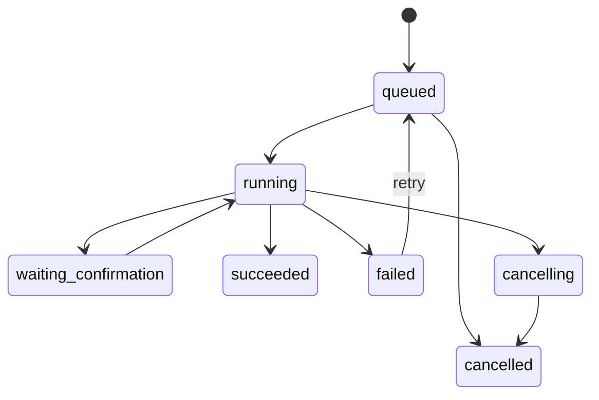

# Argos Fase 2 - Jobs Persistentes, Scheduler e Retomada

**Goal:** iniciar a camada de tarefas assincronas do Argos sobre o gateway
residente ja existente, preservando contexto, confirmacoes e auditoria.

**Dependencia obrigatoria:** Fase 1.5 concluida e validada. Jobs nao devem
herdar pendencias antigas nem executar tools com argumentos invalidos.

## Escopo inicial

- criar modelos de job com estados duraveis;
- persistir jobs em SQLite;
- expor comandos CLI de leitura antes de execucao automatica;
- preparar worker cooperativo sem concorrencia complexa na primeira entrega;
- reutilizar `AgentRequest`, `AgentResponse`, confirmacoes e eventos atuais.

## Modelo de estados

## Entrega 2.1: fundacao de jobs

**Status:** concluida.

- Create: `src/assistant/jobs/models.py`
- Create: `src/assistant/jobs/repository.py`
- Test: `tests/jobs/test_repository.py`

**Criterios:**

- job possui `job_id`, `session_id`, `run_id`, `status`, `payload`,
  `created_at`, `updated_at`, `attempts` e `last_error`;
- transicoes invalidas sao rejeitadas;
- jobs sobrevivem a reabertura do repositorio.

## Entrega 2.2: CLI de consulta

**Status:** concluida.

- Modify: `src/assistant/cli.py`
- Test: `tests/jobs/test_cli.py`

**Criterios:**

- `argos jobs list` mostra jobs recentes;
- `argos jobs show <id>` mostra status, timestamps e erro seguro;
- `argos jobs retry <id>` recoloca jobs com falha na fila;
- `argos jobs cancel <id>` cancela jobs ainda nao terminais;
- nenhum comando executa trabalho em background ainda.

## Entrega 2.3: worker simples

**Status:** fundacao concluida. Integracao automatica com o gateway fica para a
proxima entrega da Fase 2.

- Create: `src/assistant/jobs/worker.py`
- Modify: `src/assistant/gateway/service.py`
- Test: `tests/jobs/test_worker.py`

**Criterios:**

- worker executa um job `queued` por vez;
- falhas registram `failed` com erro seguro;
- confirmacao pausa em `waiting_confirmation`;
- retry manual recoloca `failed` em `queued`.

## Entrega 2.4: lembretes persistentes

**Status:** concluida para agendamento persistente. A notificacao automatica
residente fica para a proxima entrega da Fase 2.

- Modify: `src/assistant/planner.py`
- Modify: `src/assistant/execution/executor.py`
- Modify: `src/assistant/jobs/repository.py`
- Modify: `src/assistant/cli.py`
- Test: `tests/test_planner.py`
- Test: `tests/test_executor.py`
- Test: `tests/jobs/test_repository.py`
- Test: `tests/jobs/test_worker.py`

**Criterios:**

- "me lembre que daqui 10 minutos..." vira `schedule_reminder`;
- lembretes exigem confirmacao antes de persistir;
- jobs podem ter `scheduled_for`;
- `next_queued` ignora jobs agendados para o futuro;
- `argos jobs list` e `argos jobs show` exibem o horario agendado.

## Fora do escopo inicial

- recorrencias complexas;
- UI;
- voz;
- execucao paralela;
- LangGraph como dependencia obrigatoria.
